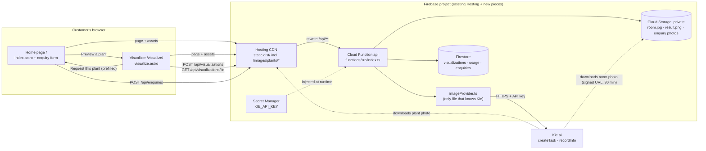
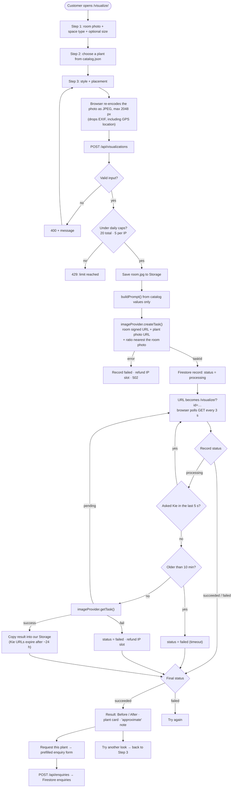
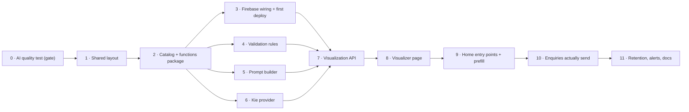

# AI Plant Visualizer Implementation Plan

> **For agentic workers:** REQUIRED SUB-SKILL: Use superpowers:subagent-driven-development (recommended) or superpowers:executing-plans to implement this plan task-by-task. Steps use checkbox (`- [ ]`) syntax for tracking.

**Goal:** A customer uploads a photo of their space, picks one Plantliner plant, a style and a placement, and gets back an AI-generated "after" image. The result stays linked to that plant and hands off in one click to the existing enquiry form.

**Architecture:** The Astro site stays static on Firebase Hosting. One new Firebase Cloud Function, `api`, sits behind a Hosting rewrite for `/api/**`. It validates input, enforces daily caps, stores images in private Cloud Storage, keeps records in Firestore, and talks to Kie.ai through a single file, `imageProvider.ts`. The browser polls the function for status, and the function polls Kie (no webhook). The plant catalog is one JSON file shared by the site and the function.

**Tech Stack:** Astro 6 (static), TypeScript, Firebase Hosting, Cloud Functions (2nd gen, Node 22), Firestore, Cloud Storage, Secret Manager, the Kie.ai `google/nano-banana-edit` model, and Node's built-in test runner (`node:test`).

**Spec:** The architecture report from the 2026-10-03 Claude Code session. Everything an implementer needs from it is restated in *Decisions*, *Architecture* and *Global Constraints* below.

## Before you start

- `src/pages/index.astro` and `src/styles/global.css` had uncommitted redesign work in progress when this plan was written. Commit or stash it before Task 1. Every edit in this plan is anchored on quoted code, not line numbers, so it survives that redesign.
- Steps marked **(you)** need a human in a browser: the Firebase console, the Kie dashboard, and plant photos.

## Decisions baked into this plan

| Decision | Default in this plan | Where to change it |
|---|---|---|
| What the result page leads to | **"Request this plant"** pre-fills the existing enquiry form. No cart exists yet; building one is a separate project. | `#viz-request` link (Task 8), prefill (Task 9) |
| Access | Anonymous, with daily caps: **20/day in total, 5/day per IP** | `DAILY_CAP`, `IP_CAP` in active `api/_lib/handlers.ts` |
| Space types | office, café, school, retail, other: the site's existing set and `SpaceIcon` variants | `spaceTypes` in `src/data/catalog.json`, plus a path in `SpaceIcon.astro` |
| Prices | Not shown (the site has none) | Add `price` to catalog plants and the result card |
| Region | us-central1 (Firebase default, simplest Hosting rewrite) | `region` in `onRequest` options and in the `firebase.json` rewrite |
| AI model | `google/nano-banana-edit`, unless Task 0 says otherwise | `MODEL` in `imageProvider.ts` |
| Output shape | The allowed ratio nearest the room photo's own shape, never `auto` (G0 run 1: a landscape room came back as a portrait image) | `nearestRatio` in `functions/src/rules.ts` |
| Webhook | None. The function polls Kie whenever the browser polls the function ("poll-through"). | `ponytail:` comment in Task 7 |
| Captcha | Not in the MVP. The global cap already bounds spend; a captcha protects availability, not cost. *(Revised from the report.)* | Add Cloudflare Turnstile when non-customers start exhausting the daily cap |
| Environments | One Firebase project. `npm run dev` uses the deployed API. | Add a staging project when a second developer or real traffic arrives |
| Retention | Visualizations (record and images) are deleted after 30 days. Enquiries are kept. | Task 11 |
| Site host *(decided 2026-10-04)* | **The site is on Vercel, not Firebase Hosting.** Firebase hosts only the `api` function, Firestore and Storage. A Vercel rewrite sends `/api/*` to the function's Cloud Run URL, so the browser still sees one origin. Task 3's Hosting parts (`hosting` block in `firebase.json`, `.web.app` URLs, the 404 skeleton) are superseded. `SITE_URL` (a function param) is the Vercel site, where Kie downloads plant photos; `API_ORIGIN` in `.env` is the dev proxy target. | `vercel.json` (added after the first deploy), `SITE_URL`, `astro.config.mjs` |
| Backend host *(revised 2026-10-04, supersedes the Firebase rows above)* | **Card trouble ruled out Firebase (Blaze).** The API is Vercel Functions in `api/` (same origin, no rewrite). Records, private image storage and the daily-cap/refund logic are **Supabase** (free plan): tables and functions in `supabase/migrations/0001_init.sql`. A daily Vercel cron (`api/cron/cleanup`) does the 30-day retention and keeps the free project from pausing. Secrets are Vercel environment variables (`KIE_API_KEY`, `SUPABASE_URL`, `SUPABASE_SERVICE_ROLE_KEY`, `CRON_SECRET`). `functions/`, `firebase.json`, `firestore.rules` and `storage.rules` are the superseded Firebase attempt, to be deleted once the Supabase path is verified. | `api/_lib/db.ts`, `api/_lib/handlers.ts`, `vercel.json` |

## Architecture

### System flowchart



### Generation flowchart



### Task order



### File map

| File | Status | Responsibility |
|---|---|---|
| `src/layouts/BaseLayout.astro` | Create | Head, fonts, header, footer and menu script shared by every page |
| `src/data/catalog.json` | Create | **The** catalog: plants, styles, placements, space types (read by the site and the function) |
| `public/images/plants/<id>.jpg` | Create | Product photos, shown on the site and sent to Kie as the reference image |
| `src/scripts/photo.ts` | Create | `toJpegBase64(file)`: browser-side downscale and re-encode |
| `src/pages/visualize.astro` | Create | Wizard, progress view, result view, failure view |
| `functions/package.json`, `functions/tsconfig.json` | Create | Functions package (ESM, Node 22, `tsc` → `lib/`) |
| `functions/src/catalog.ts` | Create | Typed access to the copied catalog |
| `functions/src/rules.ts` | Create | Pure input validation and polling policy |
| `functions/src/prompt.ts` | Create | Pure prompt builder |
| `functions/src/imageProvider.ts` | Create | The only Kie-aware code: `createTask`, `getTask`, `parseTask` |
| `functions/src/index.ts` | Create | `api` HTTP function: routes, caps, Firestore, Storage |
| `functions/src/*.test.ts` | Create | `node:test` checks for catalog, rules, prompt, provider parsing |
| `firestore.rules`, `storage.rules` | Create | Deny all direct browser access |
| `src/pages/index.astro` | Modify | Use the layout, add visualizer entry points, prefill from the result, real form submission |
| `src/styles/global.css` | Modify | Make three ID-bound form selectors reusable, add visualizer styles |
| `firebase.json`, `astro.config.mjs`, `tsconfig.json`, `.gitignore`, `README.md` | Modify | Wiring, dev proxy, excludes, docs |

## Global Constraints

- Astro stays static: no SSR adapter, no `output: 'server'`.
- No new frontend dependencies. The only backend dependencies are `firebase-functions` and `firebase-admin`, plus `typescript@5` and `@types/node@22` as dev dependencies.
- Functions are ESM on Node 22: `"type": "module"`, `"engines": { "node": "22" }`, compiled by `tsc` to `functions/lib/`.
- The Kie key lives only in Secret Manager as `KIE_API_KEY`: never in Astro code, `.env` files or git.
- **Upload format:**
  - The browser re-encodes every uploaded photo as JPEG: max **2048 px** on the long edge, quality **0.85**.
  - The server accepts JPEG only, max **8 MB** decoded.
  - The visualizer accepts JPG/PNG/WebP input up to **25 MB** before re-encoding. The enquiry form keeps its existing 10 MB limit.
- The prompt is built only from catalog values. No customer free text reaches the AI.
- Never send `image_size: 'auto'` to Kie. G0 run 1 showed it can follow the plant photo's shape: a landscape (~4:3) room came back as an 864×1184 portrait with its right side cut off. Send the allowed ratio nearest to the room photo's own shape (`nearestRatio` in `rules.ts`, passed to `createTask` as `aspect`). G0 run 2 confirmed this keeps the framing: the same room with `4:3` came back 1184×864.
- Plants are referenced by `productId`, which is the catalog `id`. Visualization records store `items: [{ productId, quantity }]`.
- Wherever a result is shown, it is labelled as an approximate AI visualization.
- Anyone with a `/visualize/?id=…` link can view that result, and the page says so.
- API responses carry `Cache-Control: private, no-store`.
- Mark deliberate simplifications with a `ponytail:` comment that names the limitation and the upgrade path.
- Shell commands assume Git Bash at the repo root unless a step says otherwise.

## Review Focus

1. **Double-clicking "Create my preview"** must cause exactly one paid generation. Manual check pinned in Task 8, Step 7.
2. **Awkward photos:** one the browser can't decode, one over 25 MB, and a portrait phone photo. Each should give a friendly error, a rejection, or an upright image whose result stays portrait, respectively. Pinned in Task 8, Step 7.
3. **Reloading or reopening `/visualize/?id=…` mid-generation** must resume and show the result. Pinned in Task 8, Step 7.
4. **Daily cap reached:** the customer sees a clear "limit reached" message and no generation starts. Pinned in Task 7, Step 7.
5. **Kie reports success but returns no image URL:** treat it as a failure, not an endless spinner. Unit test in Task 6.

---

### Task 0: Prove the AI output is good enough (gate)

Nothing in this task touches the repo. If the output isn't good enough, stop here; nothing else is worth building.

> **Update from the first two real runs (2026-10-03):** the script actually used lives in `C:\Users\Asus\kie-spike\` (see the task board), not in the snippet below. It supports a per-room `imageSize`. With `auto`, a landscape room came back as a portrait image with the room re-cropped; with `4:3` the framing held. Tasks 4, 6 and 7 below now send an explicit ratio.

**Files:**
- Create (outside the repo, e.g. `~/kie-spike/`): `kie-spike.mjs`, `spike.json`

- [ ] **Step 1 (you): Get a Kie key.** Create a Kie.ai account, add a small credit balance, and create an API key.

- [ ] **Step 2 (you): Gather test images.**
  - **5 real room photos** (office, café, reception and so on), with varied light and angles.
  - **2–3 plant product photos**: a clean shot on a plain background, with the whole plant and pot visible.
  - Upload them anywhere that gives a public HTTPS URL. The quickest option: Firebase console → Storage (this needs the Blaze plan, which Task 3 needs anyway) → upload → open the file → copy its download URL.

- [ ] **Step 3: Create `~/kie-spike/spike.json`** with your URLs:

```json
{
  "rooms": [
    "https://firebasestorage.googleapis.com/…/office-1.jpg",
    "https://firebasestorage.googleapis.com/…/cafe-1.jpg"
  ],
  "plants": [
    { "name": "Snake Plant", "heightCm": 80, "potDiameterCm": 25, "url": "https://firebasestorage.googleapis.com/…/snake-plant.jpg" },
    { "name": "Monstera", "heightCm": 120, "potDiameterCm": 30, "url": "https://firebasestorage.googleapis.com/…/monstera.jpg" }
  ]
}
```

- [ ] **Step 4: Create `~/kie-spike/kie-spike.mjs`**

```js
// Throwaway quality test for the AI Plant Visualizer. Keep it outside the repo.
// Usage (Git Bash): KIE_API_KEY=your-key node kie-spike.mjs spike.json [model]
import { readFileSync, writeFileSync } from 'node:fs';

const [file = 'spike.json', model = 'google/nano-banana-edit'] = process.argv.slice(2);
const { rooms, plants } = JSON.parse(readFileSync(file, 'utf8'));
const headers = { Authorization: `Bearer ${process.env.KIE_API_KEY}`, 'Content-Type': 'application/json' };
const api = 'https://api.kie.ai/api/v1/jobs';
const sleep = (ms) => new Promise((resolve) => setTimeout(resolve, ms));

// Same wording as functions/src/prompt.ts (Task 5) for: office, corner placement, Minimalist.
const prompt = (plant) => [
  `Edit the first image, a photo of a real office. Add exactly one ${plant.name}: the potted plant shown in the second image. Place it standing on the floor in an empty corner, without blocking doors, walkways or furniture.`,
  'Keep everything else in the first image exactly as it is: walls, windows, floor, ceiling, furniture, objects, lighting, camera angle, perspective and framing. Do not add, remove, move or restyle anything else, and do not add any other plants or decorations.',
  `The plant must clearly be the one in the second image: same species, leaf shape, colours and pot. It is about ${plant.heightCm} cm tall including its pot, and the pot is about ${plant.potDiameterCm} cm wide. Scale it realistically against the furniture and doors in the room.`,
  "Match the room's light direction, colour temperature and shadows, and give the pot a soft, realistic contact shadow.",
  'Design direction: Minimalist, calm and uncluttered, with clear space around the plant. Use this only to decide how the plant sits in the space; do not restyle the room.',
  'The result must look like an unedited photograph of the same room with the plant added.',
].join('\n\n');

const results = [];
for (const room of rooms) {
  for (const plant of plants) {
    const created = await (await fetch(`${api}/createTask`, {
      method: 'POST',
      headers,
      body: JSON.stringify({ model, input: { prompt: prompt(plant), image_urls: [room, plant.url], output_format: 'png', image_size: '4:3' /* your rooms' own ratio, never 'auto' */ } }),
    })).json();
    if (created.code !== 200) { console.log('createTask failed:', created); continue; }
    const started = Date.now();
    let task;
    do {
      await sleep(5000);
      task = (await (await fetch(`${api}/recordInfo?taskId=${created.data.taskId}`, { headers })).json()).data;
    } while (!['success', 'fail'].includes(task?.state) && Date.now() - started < 10 * 60_000);
    if (!results.length) console.log('Raw recordInfo data (keep this for Task 6):\n', JSON.stringify(task, null, 2));
    results.push({ room, plant: plant.name, state: task?.state, seconds: Math.round((Date.now() - started) / 1000), credits: task?.creditsConsumed, resultJson: task?.resultJson, error: task?.failMsg });
    console.log(results.at(-1));
  }
}
writeFileSync('spike-results.json', JSON.stringify(results, null, 2));
console.log('Done. Open each result URL and score it against the pass bar.');
```

- [ ] **Step 5: Run it**

Run: `cd ~/kie-spike && KIE_API_KEY=your-key node kie-spike.mjs spike.json`
Expected: one line per room × plant pair with `state: 'success'`, then a `spike-results.json` file.

- [ ] **Step 6 (you): Score the results.** Open each image URL found in `resultJson`.
  - **Pass bar: at least 7 of 10** results meet all of these:
    - The room is unchanged (walls, furniture, framing).
    - Exactly one plant was added.
    - It is recognisably the product, with the right pot.
    - It is a plausible size.
  - Also note the average `seconds` and `credits` per image. They set `DAILY_CAP` (Task 7) and your Kie balance (Task 11).

- [ ] **Step 7: Record the decision.**
  - **If it passes:**
    - Keep the model. If you tried another model and it won, note its name for `MODEL` in Task 6.
    - If you changed the prompt wording to get there, carry the exact wording into Task 5.
    - If the raw `recordInfo` output doesn't contain `"resultJson": "{\"resultUrls\":[…]}"`, adjust `parseTask` and its test in Task 6 to match what you saw.
  - **If it fails:** stop and rethink the model or the feature before writing any code.

---

### Task 1: Shared page layout

Pure refactor: the home page must look and behave exactly as before. A second page (Task 8) needs the same head, header and footer.

**Files:**
- Create: `src/layouts/BaseLayout.astro`
- Modify: `src/pages/index.astro`

**Interfaces:**
- Produces: `BaseLayout` with props `{ title: string; description: string }`. Its default slot renders inside `<main id="main">`. Header links are absolute (`/#solutions`), so they work from any page.

- [ ] **Step 1: Create `src/layouts/BaseLayout.astro`**

Move the header and footer markup from `index.astro` as it is now. If the redesign changed that markup since this plan was written, move whatever is there. Only the `href` changes (`#x` becomes `/#x`) matter. Expected result as of this plan:

```astro
---
import ArrowIcon from '../components/ArrowIcon.astro';
import '../styles/global.css';

interface Props {
  title: string;
  description: string;
}
const { title, description } = Astro.props;
---

<!doctype html>
<html lang="en">
  <head>
    <meta charset="UTF-8" />
    <meta name="viewport" content="width=device-width, initial-scale=1.0" />
    <meta name="theme-color" content="#f5f4ed" />
    <meta name="description" content={description} />
    <title>{title}</title>
    <link rel="preconnect" href="https://fonts.googleapis.com" />
    <link rel="preconnect" href="https://fonts.gstatic.com" crossorigin />
    <link href="https://fonts.googleapis.com/css2?family=DM+Sans:wght@400;500;600;700&family=DM+Serif+Display:ital@0;1&display=swap" rel="stylesheet" />
  </head>
  <body>
    <a class="skip-link" href="#main">Skip to content</a>
    <header class="site-header" id="top">
      <div class="header-inner container">
        <a class="brand" href="/#top" aria-label="Plantliner home">
          <span class="brand-mark" aria-hidden="true"><span></span><span></span></span>
          <span>plantliner<span class="brand-dot">.</span></span>
        </a>
        <nav class="desktop-nav" aria-label="Main navigation">
          <a href="/#solutions">Solutions</a>
          <a href="/#how-it-works">How it works</a>
          <a href="/#faq">FAQ</a>
        </nav>
        <a class="button button-dark header-cta" href="/#enquiry">Request a plant plan <span aria-hidden="true"><ArrowIcon direction="up-right" /></span></a>
        <button class="menu-toggle" type="button" aria-label="Open menu" aria-expanded="false" aria-controls="mobile-nav">
          <span></span><span></span>
        </button>
      </div>
      <nav class="mobile-nav" id="mobile-nav" aria-label="Mobile navigation" hidden>
        <a href="/#solutions">Solutions</a>
        <a href="/#how-it-works">How it works</a>
        <a href="/#faq">FAQ</a>
        <a href="/#enquiry">Request a plant plan</a>
      </nav>
    </header>

    <main id="main">
      <slot />
    </main>

    <footer class="site-footer">
      <div class="container footer-inner">
        <div>
          <a class="brand footer-brand" href="/#top"><span class="brand-mark" aria-hidden="true"><span></span><span></span></span><span>plantliner<span class="brand-dot">.</span></span></a>
          <p>The right fit for every plant need.</p>
        </div>
        <nav aria-label="Footer navigation"><a href="/#solutions">Solutions</a><a href="/#how-it-works">How it works</a><a href="/#faq">FAQ</a><a href="/#enquiry">Get in touch</a></nav>
      </div>
      <div class="container footer-bottom"><span>© {new Date().getFullYear()} Plantliner</span><span>Made for spaces that grow.</span><a href="#top">Back to top <ArrowIcon direction="up" /></a></div>
    </footer>

    <script>
      const menuButton = document.querySelector<HTMLButtonElement>('.menu-toggle');
      const mobileNav = document.querySelector<HTMLElement>('.mobile-nav');
      menuButton?.addEventListener('click', () => {
        const expanded = menuButton.getAttribute('aria-expanded') === 'true';
        menuButton.setAttribute('aria-expanded', String(!expanded));
        menuButton.setAttribute('aria-label', expanded ? 'Open menu' : 'Close menu');
        if (mobileNav) mobileNav.hidden = expanded;
      });
      const closeMenu = () => {
        if (!mobileNav || mobileNav.hidden) return;
        mobileNav.hidden = true;
        menuButton?.setAttribute('aria-expanded', 'false');
        menuButton?.setAttribute('aria-label', 'Open menu');
      };
      mobileNav?.querySelectorAll('a').forEach((link) => link.addEventListener('click', closeMenu));
      document.addEventListener('keydown', (event) => {
        if (event.key !== 'Escape' || !mobileNav || mobileNav.hidden) return;
        closeMenu();
        menuButton?.focus();
      });
      document.addEventListener('click', (event) => {
        if (!document.querySelector('.site-header')?.contains(event.target as Node)) closeMenu();
      });
    </script>
  </body>
</html>
```

- [ ] **Step 2: Switch `src/pages/index.astro` to the layout.** Make these five edits:

1. In the frontmatter, replace `import '../styles/global.css';` with `import BaseLayout from '../layouts/BaseLayout.astro';`. Keep the `ArrowIcon` import; the page still uses it.
2. Replace everything from `<!doctype html>` down to and including `<main id="main">` with:

```astro
<BaseLayout title="Plantliner — The right plant for the right space" description="Plantliner creates thoughtful plant solutions for offices, cafés, schools, and retail spaces. Find the right plant for your space.">
```

3. Delete `</main>` and the whole `<footer class="site-footer">…</footer>` line that follows it.
4. In the `<script>`, delete the menu block: from `const menuButton = document.querySelector<HTMLButtonElement>('.menu-toggle');` through the `document.addEventListener('click', …closeMenu();\n});` block. It now lives in the layout.
5. Replace the closing `    </script>\n  </body>\n</html>` with:

```astro
    </script>
</BaseLayout>
```

- [ ] **Step 3: Verify nothing changed**

Run: `npm run check`
Expected: `0 errors`

Run: `npm run build && npm run preview`, then open http://localhost:4321
Expected:
- The page looks identical.
- Header links scroll to their sections.
- The mobile menu (narrow the window) opens, closes on link click, and closes on Escape.
- The footer "Back to top" works.

- [ ] **Step 4: Commit**

```bash
git add src/layouts/BaseLayout.astro src/pages/index.astro
git commit -m "Extract shared page layout"
```

---

### Task 2: Plant catalog and functions package

**Files:**
- Create: `functions/package.json`, `functions/tsconfig.json`, `functions/src/catalog.ts`, `functions/src/catalog.test.ts`, `src/data/catalog.json`, `public/images/plants/*.jpg`
- Modify: `.gitignore`, `tsconfig.json`

**Interfaces:**
- Produces, from `functions/src/catalog.ts`:
  - `catalog: Catalog`
  - `byId<T extends { id: string }>(list: T[], id: unknown): T | undefined`
  - types `Option = { id: string; label: string; prompt?: string }`
  - type `Plant = { id: string; name: string; image: string; heightCm: number; potDiameterCm: number; placements: string[]; description: string }`
  - type `Catalog = { spaceTypes: Option[]; styles: Option[]; placements: Option[]; plants: Plant[] }`
- Produces: `src/data/catalog.json`, which Astro pages import directly.

- [ ] **Step 1: Create the functions package**

`functions/package.json`:

```json
{
  "name": "plantliner-functions",
  "private": true,
  "type": "module",
  "main": "lib/index.js",
  "engines": { "node": "22" },
  "scripts": {
    "build": "node -e \"require('fs').copyFileSync('../src/data/catalog.json', 'src/catalog.json')\" && tsc",
    "test": "npm run build && node --test \"lib/**/*.test.js\""
  }
}
```

`functions/tsconfig.json`:

```json
{
  "compilerOptions": {
    "module": "NodeNext",
    "moduleResolution": "NodeNext",
    "target": "ES2022",
    "strict": true,
    "outDir": "lib",
    "rootDir": "src",
    "resolveJsonModule": true,
    "skipLibCheck": true,
    "sourceMap": true
  },
  "include": ["src"]
}
```

Run: `npm --prefix functions install -D typescript@5 @types/node@22`
Expected: `functions/node_modules/` exists, and `typescript` and `@types/node` appear under `devDependencies`. Without `@types/node` the first compile fails with `Cannot find module 'node:test'`.

- [ ] **Step 2: Write the failing test `functions/src/catalog.test.ts`**

```ts
import { test } from 'node:test';
import assert from 'node:assert/strict';
import { existsSync } from 'node:fs';
import { catalog } from './catalog.js';

test('catalog ids are unique and every option the prompt uses has wording', () => {
  for (const list of [catalog.spaceTypes, catalog.styles, catalog.placements, catalog.plants]) {
    const ids = list.map((item) => item.id);
    assert.equal(new Set(ids).size, ids.length, `duplicate id in: ${ids.join(', ')}`);
  }
  for (const option of [...catalog.styles, ...catalog.placements]) assert.ok(option.prompt, `${option.id} needs a prompt`);
});

test('every plant has real dimensions, known placements and a photo', () => {
  const placementIds = catalog.placements.map((placement) => placement.id);
  for (const plant of catalog.plants) {
    assert.ok(plant.heightCm > 0 && plant.potDiameterCm > 0, `${plant.id} needs real dimensions`);
    for (const placement of plant.placements) assert.ok(placementIds.includes(placement) && placement !== 'auto', `${plant.id}: unknown placement ${placement}`);
    // lib/catalog.test.js → ../../ is the repo root
    assert.ok(existsSync(new URL(`../../public${plant.image}`, import.meta.url)), `${plant.id}: missing public${plant.image}`);
  }
});
```

- [ ] **Step 3: Run it to verify it fails**

Run: `npm --prefix functions test`
Expected: FAIL with `ENOENT: no such file or directory, copyfile '../src/data/catalog.json'`

- [ ] **Step 4: Create `functions/src/catalog.ts`**

```ts
import data from './catalog.json' with { type: 'json' };

// src/data/catalog.json is the single source of truth; `npm run build` copies it here.
export type Option = { id: string; label: string; prompt?: string };
export type Plant = { id: string; name: string; image: string; heightCm: number; potDiameterCm: number; placements: string[]; description: string };
export type Catalog = { spaceTypes: Option[]; styles: Option[]; placements: Option[]; plants: Plant[] };

export const catalog: Catalog = data;
export const byId = <T extends { id: string }>(list: T[], id: unknown): T | undefined => list.find((item) => item.id === id);
```

- [ ] **Step 5: Create `src/data/catalog.json`.** The heights are typical shop sizes; replace them with the sizes you actually sell.

```json
{
  "spaceTypes": [
    { "id": "office", "label": "Office" },
    { "id": "cafe", "label": "Café" },
    { "id": "school", "label": "School" },
    { "id": "retail", "label": "Retail space" },
    { "id": "other", "label": "Something else" }
  ],
  "styles": [
    { "id": "minimalist", "label": "Minimalist", "prompt": "calm and uncluttered, with clear space around the plant" },
    { "id": "japandi", "label": "Japandi", "prompt": "quiet, natural and balanced, placed with restraint" },
    { "id": "scandinavian", "label": "Scandinavian", "prompt": "light, airy and homely" },
    { "id": "modern-corporate", "label": "Modern corporate", "prompt": "tidy, professional and symmetrical where the room allows" },
    { "id": "organic-modern", "label": "Organic modern", "prompt": "soft, natural and relaxed" },
    { "id": "industrial", "label": "Industrial", "prompt": "robust and unfussy, comfortable next to raw materials" },
    { "id": "luxury", "label": "Luxury", "prompt": "deliberate and statement-making, given generous space" }
  ],
  "placements": [
    { "id": "auto", "label": "Let AI decide", "prompt": "wherever it looks most natural" },
    { "id": "floor", "label": "On the floor", "prompt": "standing on an open area of the floor" },
    { "id": "corner", "label": "In a corner", "prompt": "standing on the floor in an empty corner" },
    { "id": "window", "label": "Near a window", "prompt": "near a window" },
    { "id": "desk", "label": "On a desk or table", "prompt": "on top of an existing desk or table" },
    { "id": "cabinet", "label": "On a cabinet or shelf", "prompt": "on top of an existing cabinet or shelf" },
    { "id": "entrance", "label": "By the entrance", "prompt": "beside the entrance or reception area" }
  ],
  "plants": [
    { "id": "snake-plant", "name": "Snake Plant", "image": "/images/plants/snake-plant.jpg", "heightCm": 80, "potDiameterCm": 25, "placements": ["floor", "corner", "entrance"], "description": "Upright, architectural leaves. Happy in low light." },
    { "id": "zz-plant", "name": "ZZ Plant", "image": "/images/plants/zz-plant.jpg", "heightCm": 60, "potDiameterCm": 22, "placements": ["floor", "cabinet", "entrance"], "description": "Glossy, forgiving and fine under office lighting." },
    { "id": "monstera", "name": "Monstera", "image": "/images/plants/monstera.jpg", "heightCm": 120, "potDiameterCm": 30, "placements": ["floor", "corner", "window"], "description": "Big split leaves for a relaxed statement." },
    { "id": "fiddle-leaf-fig", "name": "Fiddle Leaf Fig", "image": "/images/plants/fiddle-leaf-fig.jpg", "heightCm": 150, "potDiameterCm": 30, "placements": ["floor", "window", "corner"], "description": "A tall feature plant for bright spots." },
    { "id": "barrel-cactus", "name": "Barrel Cactus", "image": "/images/plants/barrel-cactus.jpg", "heightCm": 25, "potDiameterCm": 18, "placements": ["desk", "cabinet", "window"], "description": "Compact and sculptural. Loves sun." }
  ]
}
```

- [ ] **Step 6: Run the test again**

Run: `npm --prefix functions test`
Expected: FAIL on `snake-plant: missing public/images/plants/snake-plant.jpg` (the first test passes).

- [ ] **Step 7 (you): Add one photo per plant** at `public/images/plants/<id>.jpg`.
  - Clean shot on a plain background, with the whole plant and pot visible.
  - At least 1000 px tall, JPEG.
  - The pot in this photo is the pot the AI will draw.

- [ ] **Step 8: Run the test to verify it passes**

Run: `npm --prefix functions test`
Expected: PASS, 2 tests.

- [ ] **Step 9: Keep generated files out of git and out of `astro check`**

Append to `.gitignore`:

```
functions/lib/
functions/src/catalog.json
.firebase/
*-debug.log
```

In `tsconfig.json`, change `"exclude": ["dist"]` to `"exclude": ["dist", "functions"]`.

Run: `npm run check`
Expected: `0 errors`

- [ ] **Step 10: Commit**

```bash
git add .gitignore tsconfig.json src/data/catalog.json public/images/plants functions/package.json functions/package-lock.json functions/tsconfig.json functions/src/catalog.ts functions/src/catalog.test.ts
git commit -m "Add shared plant catalog and functions package"
```

---

### Task 3: Firebase wiring and first deploy

**Files:**
- Create: `functions/src/index.ts`, `firestore.rules`, `storage.rules`, `.firebaserc` (written by the CLI)
- Modify: `firebase.json`, `astro.config.mjs`

**Interfaces:**
- Produces: an HTTPS function `api`, reachable at `https://<project>.web.app/api/**`.
- Produces: `npm run dev` proxies `/api` to it.

- [ ] **Step 1 (you): Prepare the Firebase project** in the console:
  1. **Upgrade to the Blaze plan.** Functions and Storage need it.
  2. **Build → Firestore → Create database:** production mode, US multi-region (`nam5`).
  3. **Build → Storage → Get started:** production mode, a US location.

- [ ] **Step 2: Connect the CLI**

Run: `npm install -g firebase-tools && firebase login && firebase use --add`
When prompted, pick the project that hosts the site and type the alias `default`.
Expected: a `.firebaserc` file containing `{"projects":{"default":"<your-project-id>"}}`.

- [ ] **Step 3: Install the backend SDKs**

Run: `npm --prefix functions install firebase-functions firebase-admin`
Expected: both appear under `dependencies` in `functions/package.json`.

- [ ] **Step 4: Create `functions/src/index.ts`.** This is a skeleton that answers 404; Task 7 replaces it.

```ts
import { onRequest } from 'firebase-functions/v2/https';

export const api = onRequest({ maxInstances: 5 }, (req, res) => {
  res.set('Cache-Control', 'private, no-store');
  res.status(404).json({ error: 'Not found' });
});
```

- [ ] **Step 5: Create the deny-all rules.** The Admin SDK in the function bypasses these rules; browsers get nothing.

`firestore.rules`:

```
rules_version = '2';
service cloud.firestore {
  match /databases/{database}/documents {
    // All reads and writes go through the `api` Cloud Function (Admin SDK).
    match /{document=**} { allow read, write: if false; }
  }
}
```

`storage.rules`:

```
rules_version = '2';
service firebase.storage {
  match /b/{bucket}/o {
    // Images are private; the `api` function hands out short-lived signed URLs.
    match /{allPaths=**} { allow read, write: if false; }
  }
}
```

- [ ] **Step 6: Replace `firebase.json`**

```json
{
  "hosting": {
    "public": "dist",
    "ignore": ["firebase.json", "**/.*", "**/node_modules/**"],
    "predeploy": ["npm run build"],
    "rewrites": [{ "source": "/api/**", "function": { "functionId": "api" } }]
  },
  "functions": {
    "source": "functions",
    "ignore": ["node_modules", ".git", "firebase-debug.log", "firebase-debug.*.log", "*.local"],
    "predeploy": ["npm --prefix functions run build"]
  },
  "firestore": { "rules": "firestore.rules" },
  "storage": { "rules": "storage.rules" }
}
```

- [ ] **Step 7: Replace `astro.config.mjs`.** This makes the local dev server talk to the deployed API.

```js
import { defineConfig } from 'astro/config';
import { readFileSync } from 'node:fs';

// ponytail: one environment; `npm run dev` talks to the deployed api. Add a staging project when there's a second developer.
const project = JSON.parse(readFileSync('.firebaserc', 'utf8')).projects.default;

export default defineConfig({
  vite: { server: { proxy: { '/api': { target: `https://${project}.web.app`, changeOrigin: true } } } },
});
```

- [ ] **Step 8: Deploy**

Run: `firebase deploy`
The first deploy enables Cloud Functions, Cloud Build, Artifact Registry and Cloud Run. If it asks about an Artifact Registry cleanup policy, accept the default; it keeps old-image storage costs near zero.
Expected: `Deploy complete!`

- [ ] **Step 9: Verify the rewrite**

```bash
PROJECT=$(node -p "JSON.parse(require('fs').readFileSync('.firebaserc','utf8')).projects.default")
curl -si "https://$PROJECT.web.app/api/ping"
curl -so /dev/null -w "%{http_code}\n" "https://$PROJECT.web.app/"
```

Expected:
- The first command shows `HTTP/2 404`, a `cache-control: private, no-store` header, and the body `{"error":"Not found"}`.
- The second prints `200`.

- [ ] **Step 10: Commit**

```bash
git add .firebaserc firebase.json firestore.rules storage.rules astro.config.mjs functions/package.json functions/package-lock.json functions/src/index.ts
git commit -m "Wire Firebase Functions behind /api"
```

---

### Task 4: Input validation and polling rules

**Files:**
- Create: `functions/src/rules.ts`, `functions/src/rules.test.ts`

**Interfaces:**
- Consumes: `catalog`, `byId`, `Option`, `Plant` from `./catalog.js`
- Produces:
  - Constants: `MAX_IMAGE_BYTES`, `CHECK_EVERY_MS`, `GIVE_UP_AFTER_MS`
  - Types:
    - `Parsed<T> = { ok: true; value: T } | { ok: false; error: string }`
    - `Dims = { widthM?: number; lengthM?: number; ceilingM?: number }`
    - `VisualizationInput = { image: Buffer; space: Option; plant: Plant; style: Option; placement: Option; dims: Dims; aspect: string }`, where `aspect` is the Kie ratio nearest the photo's own shape
  - Functions:
    - `parseImage(base64: unknown): Parsed<Buffer>`
    - `jpegSize(image: Buffer): { width: number; height: number } | null`, read from the JPEG's frame header
    - `nearestRatio(width: number, height: number): string`, one of Kie's ratios (never `auto`)
    - `parseVisualizationRequest(body: unknown): Parsed<VisualizationInput>`, where the body is `{ image, spaceType, productId, style, placement, dims? }`
    - `nextStep(v: { status: string; createdAt: number; checkedAt: number }, now: number): 'done' | 'timeout' | 'check' | 'wait'`

- [ ] **Step 1: Write the failing test `functions/src/rules.test.ts`**

```ts
import { test } from 'node:test';
import assert from 'node:assert/strict';
import { parseVisualizationRequest, nextStep, jpegSize, nearestRatio, MAX_IMAGE_BYTES } from './rules.js';

// A minimal JPEG: the start marker, one frame header (SOF0) carrying the size, and the end marker.
const jpegOf = (width: number, height: number) =>
  Buffer.from([0xff, 0xd8, 0xff, 0xc0, 0x00, 0x11, 0x08, height >> 8, height & 255, width >> 8, width & 255, 0x03, 0x01, 0x22, 0x00, 0x02, 0x11, 0x01, 0x03, 0x11, 0x01, 0xff, 0xd9]);
const jpeg = jpegOf(1200, 896).toString('base64');
const valid = { image: jpeg, spaceType: 'office', productId: 'snake-plant', style: 'japandi', placement: 'auto' };

test('accepts a valid request and resolves catalog entries', () => {
  const result = parseVisualizationRequest(valid);
  assert.ok(result.ok);
  assert.equal(result.value.plant.id, 'snake-plant');
  assert.equal(result.value.style.id, 'japandi');
  assert.deepEqual(result.value.dims, {});
  assert.equal(result.value.aspect, '4:3');
});

test('rejects anything outside the catalog', () => {
  for (const key of ['spaceType', 'productId', 'style', 'placement']) {
    assert.equal(parseVisualizationRequest({ ...valid, [key]: 'nope' }).ok, false, key);
  }
  assert.equal(parseVisualizationRequest(undefined).ok, false);
});

test('accepts only JPEG images up to the size limit', () => {
  const png = Buffer.from([0x89, 0x50, 0x4e, 0x47]).toString('base64');
  assert.equal(parseVisualizationRequest({ ...valid, image: png }).ok, false);
  assert.equal(parseVisualizationRequest({ ...valid, image: '' }).ok, false);
  const big = Buffer.alloc(MAX_IMAGE_BYTES + 1);
  big.set([0xff, 0xd8, 0xff]);
  assert.equal(parseVisualizationRequest({ ...valid, image: big.toString('base64') }).ok, false);
});

test('keeps sensible room sizes and rejects silly ones', () => {
  const result = parseVisualizationRequest({ ...valid, dims: { widthM: 6, ceilingM: 2.7 } });
  assert.ok(result.ok);
  assert.deepEqual(result.value.dims, { widthM: 6, ceilingM: 2.7 });
  assert.equal(parseVisualizationRequest({ ...valid, dims: { ceilingM: 300 } }).ok, false);
  assert.equal(parseVisualizationRequest({ ...valid, dims: { widthM: '6' } }).ok, false);
});

test("matches the output to the room photo's own shape, and rejects photos with no readable size", () => {
  assert.deepEqual(jpegSize(jpegOf(1200, 896)), { width: 1200, height: 896 });
  assert.equal(nearestRatio(1200, 896), '4:3'); // landscape stays landscape (G0 run 1: 'auto' returned a portrait)
  assert.equal(nearestRatio(896, 1200), '3:4');
  assert.equal(nearestRatio(1920, 1080), '16:9');
  assert.equal(nearestRatio(3000, 1000), '21:9');
  const portrait = parseVisualizationRequest({ ...valid, image: jpegOf(900, 1600).toString('base64') });
  assert.ok(portrait.ok);
  assert.equal(portrait.value.aspect, '9:16');
  // A JPEG signature with no frame header, or a zero-sized one, cannot be shown to the model.
  const noFrame = Buffer.from([0xff, 0xd8, 0xff, 0xe0, 0, 0]).toString('base64');
  assert.equal(parseVisualizationRequest({ ...valid, image: noFrame }).ok, false);
  assert.equal(parseVisualizationRequest({ ...valid, image: jpegOf(0, 0).toString('base64') }).ok, false);
});

test('asks the provider at most every 5 s and gives up after 10 min', () => {
  const t = 1_000_000;
  assert.equal(nextStep({ status: 'succeeded', createdAt: t, checkedAt: t }, t), 'done');
  assert.equal(nextStep({ status: 'processing', createdAt: t, checkedAt: t }, t + 1_000), 'wait');
  assert.equal(nextStep({ status: 'processing', createdAt: t, checkedAt: t }, t + 5_000), 'check');
  assert.equal(nextStep({ status: 'processing', createdAt: t, checkedAt: t }, t + 10 * 60_000 + 1), 'timeout');
});
```

- [ ] **Step 2: Run it to verify it fails**

Run: `npm --prefix functions test`
Expected: FAIL with `Cannot find module './rules.js'` (a TS2307 compile error).

- [ ] **Step 3: Create `functions/src/rules.ts`**

```ts
import { catalog, byId, type Option, type Plant } from './catalog.js';

export const MAX_IMAGE_BYTES = 8 * 1024 * 1024;
export const CHECK_EVERY_MS = 5_000;
export const GIVE_UP_AFTER_MS = 10 * 60_000;

export type Parsed<T> = { ok: true; value: T } | { ok: false; error: string };
export type Dims = { widthM?: number; lengthM?: number; ceilingM?: number };
export type VisualizationInput = { image: Buffer; space: Option; plant: Plant; style: Option; placement: Option; dims: Dims; aspect: string };

const DIM_RANGES: [keyof Dims, number, number][] = [['widthM', 1, 200], ['lengthM', 1, 200], ['ceilingM', 2, 20]];

// The browser re-encodes every photo as JPEG, so anything else is a broken or hand-made request.
export function parseImage(base64: unknown): Parsed<Buffer> {
  if (typeof base64 !== 'string' || !base64) return { ok: false, error: 'Please add a photo of your space.' };
  const image = Buffer.from(base64, 'base64');
  if (image.length > MAX_IMAGE_BYTES) return { ok: false, error: 'That photo is too large. Please try a smaller one.' };
  if (image[0] !== 0xff || image[1] !== 0xd8 || image[2] !== 0xff) return { ok: false, error: 'That photo could not be read. Please try a JPG, PNG, or WebP image.' };
  return { ok: true, value: image };
}

// Kie's allowed image_size ratios. 'auto' is left out on purpose: it can follow the plant photo's shape instead of the room's.
const RATIOS: [string, number][] = [['1:1', 1], ['9:16', 9 / 16], ['16:9', 16 / 9], ['3:4', 3 / 4], ['4:3', 4 / 3], ['3:2', 3 / 2], ['2:3', 2 / 3], ['5:4', 5 / 4], ['4:5', 4 / 5], ['21:9', 21 / 9]];

export function nearestRatio(width: number, height: number): string {
  const distance = (ratio: number) => Math.abs(Math.log(ratio / (width / height)));
  return RATIOS.reduce((best, candidate) => (distance(candidate[1]) < distance(best[1]) ? candidate : best))[0];
}

// Width and height from the first Start-Of-Frame marker; null when the file has none.
export function jpegSize(image: Buffer): { width: number; height: number } | null {
  let i = 2;
  while (i + 9 < image.length) {
    if (image[i] !== 0xff) return null;
    const marker = image[i + 1];
    if (marker >= 0xc0 && marker <= 0xcf && marker !== 0xc4 && marker !== 0xc8 && marker !== 0xcc) {
      return { height: image.readUInt16BE(i + 5), width: image.readUInt16BE(i + 7) };
    }
    const length = image.readUInt16BE(i + 2);
    if (length < 2) return null;
    i += 2 + length;
  }
  return null;
}

function parseDims(raw: unknown): Parsed<Dims> {
  const input = (raw && typeof raw === 'object' ? raw : {}) as Record<string, unknown>;
  const dims: Dims = {};
  for (const [key, min, max] of DIM_RANGES) {
    const value = input[key];
    if (value === undefined || value === null) continue;
    if (typeof value !== 'number' || !(value >= min && value <= max)) {
      return { ok: false, error: 'Please check the room size: ceiling 2–20 m, width and length 1–200 m.' };
    }
    dims[key] = value;
  }
  return { ok: true, value: dims };
}

export function parseVisualizationRequest(body: unknown): Parsed<VisualizationInput> {
  const input = (body ?? {}) as Record<string, unknown>;
  const space = byId(catalog.spaceTypes, input.spaceType);
  const plant = byId(catalog.plants, input.productId);
  const style = byId(catalog.styles, input.style);
  const placement = byId(catalog.placements, input.placement);
  if (!space || !plant || !style || !placement) return { ok: false, error: 'Please choose a space, a plant, a style and a placement.' };
  const image = parseImage(input.image);
  if (!image.ok) return image;
  const size = jpegSize(image.value);
  if (!size?.width || !size.height) return { ok: false, error: 'That photo could not be read. Please try a JPG, PNG, or WebP image.' };
  const dims = parseDims(input.dims);
  if (!dims.ok) return dims;
  return { ok: true, value: { image: image.value, space, plant, style, placement, dims: dims.value, aspect: nearestRatio(size.width, size.height) } };
}

export function nextStep(v: { status: string; createdAt: number; checkedAt: number }, now: number): 'done' | 'timeout' | 'check' | 'wait' {
  if (v.status !== 'processing') return 'done';
  if (now - v.createdAt > GIVE_UP_AFTER_MS) return 'timeout';
  return now - v.checkedAt >= CHECK_EVERY_MS ? 'check' : 'wait';
}
```

- [ ] **Step 4: Run tests to verify they pass**

Run: `npm --prefix functions test`
Expected: PASS, 8 tests.

- [ ] **Step 5: Commit**

```bash
git add functions/src/rules.ts functions/src/rules.test.ts
git commit -m "Validate visualization requests"
```

---

### Task 5: Prompt builder

**Files:**
- Create: `functions/src/prompt.ts`, `functions/src/prompt.test.ts`

**Interfaces:**
- Consumes: `catalog`, `byId` from `./catalog.js`; type `VisualizationInput` from `./rules.js`
- Produces: `buildPrompt(choices: Pick<VisualizationInput, 'space' | 'plant' | 'style' | 'placement' | 'dims'>): string`

If Task 0 changed the wording, use the tuned wording here and adjust the regexes in the test to match.

- [ ] **Step 1: Write the failing test `functions/src/prompt.test.ts`**

```ts
import { test } from 'node:test';
import assert from 'node:assert/strict';
import { buildPrompt } from './prompt.js';
import { catalog, byId } from './catalog.js';

const base = {
  space: byId(catalog.spaceTypes, 'office')!,
  plant: byId(catalog.plants, 'snake-plant')!,
  style: byId(catalog.styles, 'japandi')!,
  placement: byId(catalog.placements, 'corner')!,
  dims: {},
};

test('names the plant, its size, the placement and the style, and protects the room', () => {
  const prompt = buildPrompt(base);
  assert.match(prompt, new RegExp(`exactly one ${base.plant.name}`));
  assert.match(prompt, new RegExp(`about ${base.plant.heightCm} cm tall`));
  assert.match(prompt, /empty corner/);
  assert.match(prompt, /Design direction: Japandi/);
  assert.match(prompt, /do not add any other plants/);
  assert.doesNotMatch(prompt, /ceiling is about/);
});

test('turns ceiling height into a proportion the model can use', () => {
  const prompt = buildPrompt({ ...base, plant: { ...base.plant, heightCm: 81 }, dims: { ceilingM: 2.7 } });
  assert.match(prompt, /roughly 30% of the ceiling height/);
});

test('"Let AI decide" lists the plant\'s recommended spots, and "other" reads naturally', () => {
  const prompt = buildPrompt({ ...base, space: byId(catalog.spaceTypes, 'other')!, placement: byId(catalog.placements, 'auto')! });
  const firstSpot = byId(catalog.placements, base.plant.placements[0])!.label.toLowerCase();
  assert.match(prompt, /a photo of a real space\./);
  assert.match(prompt, new RegExp(`it suits being ${firstSpot}`));
});
```

- [ ] **Step 2: Run it to verify it fails**

Run: `npm --prefix functions test`
Expected: FAIL with `Cannot find module './prompt.js'`

- [ ] **Step 3: Create `functions/src/prompt.ts`**

```ts
import { catalog, byId } from './catalog.js';
import type { VisualizationInput } from './rules.js';

// Every word comes from the catalog or from fixed text: customer free text never reaches the model.
export function buildPrompt({ space, plant, style, placement, dims }: Pick<VisualizationInput, 'space' | 'plant' | 'style' | 'placement' | 'dims'>): string {
  const room = space.id === 'other' ? 'space' : space.label.toLowerCase();
  const spot = placement.id === 'auto'
    ? `wherever it looks most natural (it suits being ${plant.placements.map((id) => byId(catalog.placements, id)?.label.toLowerCase()).join(', ')})`
    : placement.prompt;
  const scale = [
    `It is about ${plant.heightCm} cm tall including its pot, and the pot is about ${plant.potDiameterCm} cm wide.`,
    // cm ÷ m = percent of the ceiling height
    dims.ceilingM ? `The ceiling is about ${dims.ceilingM} m high, so the plant reaches roughly ${Math.round(plant.heightCm / dims.ceilingM)}% of the ceiling height.` : '',
    dims.widthM && dims.lengthM ? `The room is roughly ${dims.widthM} m by ${dims.lengthM} m.` : '',
  ].filter(Boolean).join(' ');

  return [
    `Edit the first image, a photo of a real ${room}. Add exactly one ${plant.name}: the potted plant shown in the second image. Place it ${spot}, without blocking doors, walkways or furniture.`,
    'Keep everything else in the first image exactly as it is: walls, windows, floor, ceiling, furniture, objects, lighting, camera angle, perspective and framing. Do not add, remove, move or restyle anything else, and do not add any other plants or decorations.',
    `The plant must clearly be the one in the second image: same species, leaf shape, colours and pot. ${scale} Scale it realistically against the furniture and doors in the room.`,
    "Match the room's light direction, colour temperature and shadows, and give the pot a soft, realistic contact shadow.",
    `Design direction: ${style.label}, ${style.prompt}. Use this only to decide how the plant sits in the space; do not restyle the room.`,
    'The result must look like an unedited photograph of the same room with the plant added.',
  ].join('\n\n');
}
```

- [ ] **Step 4: Run tests to verify they pass**

Run: `npm --prefix functions test`
Expected: PASS, 11 tests.

- [ ] **Step 5: Commit**

```bash
git add functions/src/prompt.ts functions/src/prompt.test.ts
git commit -m "Build visualization prompt from catalog values"
```

---

### Task 6: Kie image provider

**Files:**
- Create: `functions/src/imageProvider.ts`, `functions/src/imageProvider.test.ts`

**Interfaces:**
- Produces:
  - `KIE_API_KEY` (a `defineSecret` declaration), `PROVIDER = 'kie'`, `MODEL`
  - type `ProviderTask = { state: 'pending' } | { state: 'success'; imageUrl: string } | { state: 'fail'; message: string }`
  - `createTask(prompt: string, imageUrls: string[], aspect: string): Promise<string>` (`aspect` is a Kie ratio from `nearestRatio`; returns the task id)
  - `getTask(taskId: string): Promise<ProviderTask>`
  - `parseTask(data: { state?: string; resultJson?: string; failMsg?: string }): ProviderTask`

- [ ] **Step 1: Write the failing test `functions/src/imageProvider.test.ts`.** If Task 0 showed a different `resultJson` shape, use that shape here.

```ts
import { test } from 'node:test';
import assert from 'node:assert/strict';
import { parseTask } from './imageProvider.js';

test('maps Kie task states', () => {
  assert.deepEqual(parseTask({ state: 'waiting' }), { state: 'pending' });
  assert.deepEqual(parseTask({ state: 'generating' }), { state: 'pending' });
  assert.deepEqual(parseTask({ state: 'success', resultJson: '{"resultUrls":["https://tempfile.example/a.png"]}' }), { state: 'success', imageUrl: 'https://tempfile.example/a.png' });
  assert.deepEqual(parseTask({ state: 'fail', failMsg: 'content policy' }), { state: 'fail', message: 'content policy' });
});

test('success without an image is a failure, not an endless wait', () => {
  assert.equal(parseTask({ state: 'success', resultJson: '{}' }).state, 'fail');
  assert.equal(parseTask({ state: 'success', resultJson: 'not json' }).state, 'fail');
  assert.equal(parseTask({ state: 'success' }).state, 'fail');
});
```

- [ ] **Step 2: Run it to verify it fails**

Run: `npm --prefix functions test`
Expected: FAIL with `Cannot find module './imageProvider.js'`

- [ ] **Step 3: Create `functions/src/imageProvider.ts`**

```ts
import { defineSecret } from 'firebase-functions/params';

// The only file that knows about Kie.ai. To change provider, rewrite this file and keep the exports.
export const KIE_API_KEY = defineSecret('KIE_API_KEY');
export const PROVIDER = 'kie';
export const MODEL = 'google/nano-banana-edit';
const BASE = 'https://api.kie.ai/api/v1/jobs';

export type ProviderTask = { state: 'pending' } | { state: 'success'; imageUrl: string } | { state: 'fail'; message: string };

async function call(path: string, init: RequestInit = {}) {
  const res = await fetch(`${BASE}${path}`, {
    ...init,
    headers: { Authorization: `Bearer ${KIE_API_KEY.value()}`, 'Content-Type': 'application/json' },
  });
  const json = (await res.json().catch(() => null)) as { code?: number; msg?: string; data?: any } | null;
  if (!res.ok || json?.code !== 200) throw new Error(`Kie ${path} failed: HTTP ${res.status} ${json?.msg ?? ''}`);
  return json.data;
}

// ponytail: no automatic retry; a failed start refunds the customer's slot and they can press the button again.
export async function createTask(prompt: string, imageUrls: string[], aspect: string): Promise<string> {
  const data = await call('/createTask', {
    method: 'POST',
    // Never 'auto': G0 run 1 returned a portrait image for a landscape room. `aspect` is the room photo's own shape.
    body: JSON.stringify({ model: MODEL, input: { prompt, image_urls: imageUrls, output_format: 'png', image_size: aspect } }),
  });
  return data.taskId;
}

export async function getTask(taskId: string): Promise<ProviderTask> {
  return parseTask(await call(`/recordInfo?taskId=${encodeURIComponent(taskId)}`));
}

export function parseTask(data: { state?: string; resultJson?: string; failMsg?: string }): ProviderTask {
  if (data.state === 'fail') return { state: 'fail', message: data.failMsg || 'Provider failed' };
  if (data.state !== 'success') return { state: 'pending' };
  let urls: unknown;
  try {
    urls = JSON.parse(data.resultJson ?? '{}').resultUrls;
  } catch {
    urls = undefined;
  }
  const imageUrl = Array.isArray(urls) && typeof urls[0] === 'string' ? urls[0] : null;
  return imageUrl ? { state: 'success', imageUrl } : { state: 'fail', message: 'Provider returned no image' };
}
```

- [ ] **Step 4: Run tests to verify they pass**

Run: `npm --prefix functions test`
Expected: PASS, 13 tests.

- [ ] **Step 5 (you): Store the Kie key in Secret Manager**

Run: `firebase functions:secrets:set KIE_API_KEY`
Paste the key when prompted.
Expected: `Created a new secret version`.

- [ ] **Step 6: Commit**

```bash
git add functions/src/imageProvider.ts functions/src/imageProvider.test.ts
git commit -m "Add Kie image provider"
```

---

### Task 7: Visualization API

**Files:**
- Modify: `functions/src/index.ts` (replace the skeleton)

**Interfaces:**
- Consumes: `parseVisualizationRequest`, `nextStep`, `Dims` (Task 4); `buildPrompt` (Task 5); `KIE_API_KEY`, `PROVIDER`, `MODEL`, `createTask`, `getTask` (Task 6)
- Produces two endpoints:
  - **`POST /api/visualizations`**
    - Body: `{ image: base64Jpeg, spaceType, productId, style, placement, dims?: { widthM?, lengthM?, ceilingM? } }`
    - Responses: `201 { id }`, `400 { error }`, `429 { error }`, `502 { error }`
  - **`GET /api/visualizations/:id`**
    - Success: `200 { status: 'processing' | 'succeeded' | 'failed', items: [{ productId, quantity }], choices: { spaceType, style, placement }, before: url | null, after: url | null }`
    - Not found: `404 { error }`
    - The `before` and `after` URLs are set only when the status is `succeeded`; they are signed and valid for 1 hour.
- Firestore `visualizations/{id}` has these fields: `status`, `items`, `spaceType`, `style`, `placement`, `dims`, `aspect`, `provider`, `model`, `taskId`, `prompt`, `error`, `ipKey`, `createdAt`, `checkedAt`, `completedAt`, `expiresAt`.

- [ ] **Step 1 (you): Allow the function to sign Storage URLs.** Do both of these once:
  1. Google Cloud console → APIs & Services → enable **IAM Service Account Credentials API**.
  2. IAM & Admin → IAM → edit the **Default compute service account** (`<project-number>-compute@developer.gserviceaccount.com`) → add the role **Service Account Token Creator**.

  Without this, the API fails with `SigningError: Permission 'iam.serviceAccounts.signBlob' denied`.

- [ ] **Step 2: Replace `functions/src/index.ts`**

```ts
import { onRequest, type Request } from 'firebase-functions/v2/https';
import * as logger from 'firebase-functions/logger';
import { initializeApp } from 'firebase-admin/app';
import { getFirestore, FieldValue, Timestamp, type DocumentReference } from 'firebase-admin/firestore';
import { getStorage } from 'firebase-admin/storage';
import { createHash } from 'node:crypto';
import { parseVisualizationRequest, nextStep, type Dims } from './rules.js';
import { buildPrompt } from './prompt.js';
import { KIE_API_KEY, PROVIDER, MODEL, createTask, getTask } from './imageProvider.js';

initializeApp();
const db = getFirestore();
const bucket = getStorage().bucket();

const DAILY_CAP = 20; // hard ceiling on paid generations per UTC day; raise here and redeploy
const IP_CAP = 5; // best effort only: offices share an IP and headers can be spoofed; DAILY_CAP is the real limit
const KEEP_MS = 30 * 24 * 60 * 60_000;
const SITE = `https://${process.env.GCLOUD_PROJECT}.web.app`; // Kie downloads plant photos from here

type Visualization = {
  status: 'processing' | 'succeeded' | 'failed';
  items: { productId: string; quantity: number }[]; // an array so a future "AI Designer" can add several plants
  spaceType: string;
  style: string;
  placement: string;
  dims: Dims;
  aspect: string; // the Kie ratio sent: nearest the room photo's own shape
  provider: string;
  model: string;
  taskId: string | null;
  prompt: string;
  error: string | null;
  ipKey: string;
  createdAt: number;
  checkedAt: number;
  completedAt: number | null;
  expiresAt: Timestamp; // a Firestore TTL policy deletes the record after this (Task 11)
};
type Reply = [status: number, body: object];

export const api = onRequest({ secrets: [KIE_API_KEY], maxInstances: 5 }, async (req, res) => {
  res.set('Cache-Control', 'private, no-store');
  let reply: Reply = [404, { error: 'Not found' }];
  try {
    const id = req.path.match(/^\/api\/visualizations\/([A-Za-z0-9]{20})$/)?.[1];
    if (req.method === 'POST' && req.path === '/api/visualizations') reply = await createVisualization(req);
    else if (req.method === 'GET' && id) reply = await getVisualization(id);
  } catch (err) {
    logger.error(err);
    reply = [500, { error: 'Something went wrong. Please try again.' }];
  }
  res.status(reply[0]).json(reply[1]);
});

async function createVisualization(req: Request): Promise<Reply> {
  const parsed = parseVisualizationRequest(req.body);
  if (!parsed.ok) return [400, { error: parsed.error }];
  const { image, ...choices } = parsed.value;

  const day = new Date().toISOString().slice(0, 10);
  const ip = String(req.headers['fastly-client-ip'] ?? req.headers['x-forwarded-for'] ?? req.ip).split(',')[0].trim();
  const ipKey = `${day}_${createHash('sha256').update(ip + day).digest('hex').slice(0, 16)}`; // rotates daily, never stores the IP
  if (!(await takeSlot(day, ipKey))) {
    return [429, { error: "Today's preview limit has been reached. Please try again tomorrow, or request a plant plan and we'll help." }];
  }

  const ref = db.collection('visualizations').doc();
  const now = Date.now();
  const record: Visualization = {
    status: 'processing',
    items: [{ productId: choices.plant.id, quantity: 1 }],
    spaceType: choices.space.id,
    style: choices.style.id,
    placement: choices.placement.id,
    dims: choices.dims,
    aspect: choices.aspect,
    provider: PROVIDER,
    model: MODEL,
    taskId: null,
    prompt: buildPrompt(choices),
    error: null,
    ipKey,
    createdAt: now,
    checkedAt: now,
    completedAt: null,
    expiresAt: Timestamp.fromMillis(now + KEEP_MS),
  };
  try {
    const roomPath = `visualizations/${ref.id}/room.jpg`;
    await bucket.file(roomPath).save(image, { contentType: 'image/jpeg' });
    record.taskId = await createTask(record.prompt, [await signedUrl(roomPath, 30), `${SITE}${choices.plant.image}`], choices.aspect);
  } catch (err) {
    logger.error('Could not start generation', err);
    await refundSlot(ipKey);
    await ref.set({ ...record, status: 'failed', error: String(err), completedAt: now });
    return [502, { error: 'We could not start your preview. Please try again.' }];
  }
  await ref.set(record);
  return [201, { id: ref.id }];
}

async function getVisualization(id: string): Promise<Reply> {
  const ref = db.doc(`visualizations/${id}`);
  const snap = await ref.get();
  if (!snap.exists) return [404, { error: 'Not found' }];
  let v = snap.data() as Visualization;

  // ponytail: poll-through instead of a Kie webhook. The browser polls us and we ask Kie at most every 5 s.
  // Add a callback endpoint that re-runs this check if customers often leave before their image is ready.
  const step = nextStep(v, Date.now());
  if (step === 'timeout') v = await finish(ref, v, { status: 'failed', error: 'Timed out' });
  if (step === 'check') {
    const task = await getTask(v.taskId!);
    if (task.state === 'success') {
      const image = await fetch(task.imageUrl); // Kie's URL expires after ~24 h, so keep our own copy
      if (!image.ok) throw new Error(`Result download failed: HTTP ${image.status}`);
      await bucket.file(`visualizations/${id}/result.png`).save(Buffer.from(await image.arrayBuffer()), { contentType: image.headers.get('content-type') ?? 'image/png' });
      v = await finish(ref, v, { status: 'succeeded' });
    } else if (task.state === 'fail') {
      await refundSlot(v.ipKey);
      v = await finish(ref, v, { status: 'failed', error: task.message });
    } else {
      await ref.update({ checkedAt: Date.now() });
    }
  }

  const done = v.status === 'succeeded';
  return [200, {
    status: v.status,
    items: v.items,
    choices: { spaceType: v.spaceType, style: v.style, placement: v.placement },
    before: done ? await signedUrl(`visualizations/${id}/room.jpg`, 60) : null,
    after: done ? await signedUrl(`visualizations/${id}/result.png`, 60) : null,
  }];
}

async function finish(ref: DocumentReference, v: Visualization, patch: { status: Visualization['status']; error?: string }) {
  const update = { ...patch, completedAt: Date.now() };
  await ref.update(update);
  return { ...v, ...update };
}

async function signedUrl(path: string, minutes: number) {
  const [url] = await bucket.file(path).getSignedUrl({ version: 'v4', action: 'read', expires: Date.now() + minutes * 60_000 });
  return url;
}

function takeSlot(day: string, ipKey: string): Promise<boolean> {
  const total = db.doc(`usage/${day}`);
  const mine = db.doc(`usage/${ipKey}`);
  return db.runTransaction(async (tx) => {
    const [totalSnap, mineSnap] = await Promise.all([tx.get(total), tx.get(mine)]);
    if ((totalSnap.data()?.count ?? 0) >= DAILY_CAP || (mineSnap.data()?.count ?? 0) >= IP_CAP) return false;
    tx.set(total, { count: FieldValue.increment(1) }, { merge: true });
    tx.set(mine, { count: FieldValue.increment(1) }, { merge: true });
    return true;
  });
}

// Only the customer's own slot comes back; the daily total counts every attempt, because attempts may cost money.
function refundSlot(ipKey: string) {
  return db.doc(`usage/${ipKey}`).set({ count: FieldValue.increment(-1) }, { merge: true });
}
```

- [ ] **Step 3: Compile and run the unit tests**

Run: `npm --prefix functions test`
Expected: PASS, 13 tests, and no TypeScript errors.

- [ ] **Step 4: Deploy the function**

Run: `firebase deploy --only functions`
Expected: `Deploy complete!`

- [ ] **Step 5: Verify the happy path with a real photo** (any JPEG under 8 MB)

```bash
PROJECT=$(node -p "JSON.parse(require('fs').readFileSync('.firebaserc','utf8')).projects.default")
node -e "const fs=require('fs');fs.writeFileSync('viz-request.json',JSON.stringify({image:fs.readFileSync(process.argv[1]).toString('base64'),spaceType:'office',productId:'snake-plant',style:'japandi',placement:'corner'}))" /path/to/room.jpg
curl -s -X POST "https://$PROJECT.web.app/api/visualizations" -H "Content-Type: application/json" --data-binary @viz-request.json
```

Expected: `{"id":"<20 characters>"}`

```bash
ID=<the id from above>
for i in $(seq 30); do curl -s "https://$PROJECT.web.app/api/visualizations/$ID"; echo; sleep 10; done
```

Expected:
- `"status":"processing"` for a while (the record has no `before` or `after` URLs yet), then `"status":"succeeded"` with both URLs.
- Opening `after` in a browser shows the room with the plant, in the same landscape or portrait shape as your photo.
- Stop the loop once it succeeds.

Keep `viz-request.json` for Step 7.

- [ ] **Step 6: Verify rejection and caching**

Run: `curl -s -X POST "https://$PROJECT.web.app/api/visualizations" -H "Content-Type: application/json" -d '{"spaceType":"office","productId":"snake-plant","style":"nope","placement":"auto"}'`
Expected: `{"error":"Please choose a space, a plant, a style and a placement."}` with no new Firestore record.

Run: `curl -sI "https://$PROJECT.web.app/api/visualizations/$ID" | grep -i cache-control`
Expected: `cache-control: private, no-store`

- [ ] **Step 7: Verify the daily cap without spending credits** (Review Focus 4)
  1. In the Firebase console → Firestore, create the document `usage/<today's UTC date, e.g. 2026-10-03>` with a number field `count` = `50`.
  2. Re-run the POST from Step 5.
  3. Expected: HTTP 429 with `"Today's preview limit has been reached…"`.
  4. Delete the document, then run `rm viz-request.json`.

- [ ] **Step 8: Inspect the stored data**
  - Firestore `visualizations/$ID` should have `status: "succeeded"`, `items: [{productId: "snake-plant", quantity: 1}]`, a `prompt` string, a `taskId`, an `aspect` matching your photo (`"4:3"` for a landscape photo, `"3:4"` for a portrait one), and `expiresAt` about 30 days ahead.
  - Storage `visualizations/$ID/` should contain `room.jpg` and `result.png`, and `result.png` has the same landscape or portrait shape as `room.jpg`.

- [ ] **Step 9: Commit**

```bash
git add functions/src/index.ts
git commit -m "Add visualization API with caps and poll-through generation"
```

---

### Task 8: Visualizer page

**Files:**
- Create: `src/scripts/photo.ts`, `src/pages/visualize.astro`
- Modify: `src/styles/global.css`, `src/pages/index.astro` (one class added)

**Interfaces:**
- Consumes: the Task 7 API; `src/data/catalog.json`; `BaseLayout`; `SpaceIcon` variants `office | cafe | school | retail | other`
- Produces:
  - `toJpegBase64(file: File, maxEdge?: number): Promise<string>`, which returns base64 with no `data:` prefix. Used again in Task 10.
  - The `/visualize/` page. `?plant=<id>` preselects a plant; `?id=<visualizationId>` resumes a generation or shows its result.
  - The result's **Request this plant** link: `/?space=<spaceType>&plant=<productId>&visualization=<id>#enquiry` (consumed in Task 9).

- [ ] **Step 1: Create `src/scripts/photo.ts`**

```ts
// Re-encodes a photo as a JPEG no larger than `maxEdge` px on its long edge. This shrinks uploads,
// applies the camera's EXIF rotation, and drops EXIF data (including GPS location) before anything leaves the browser.
export async function toJpegBase64(file: File, maxEdge = 2048): Promise<string> {
  const bitmap = await createImageBitmap(file); // throws for formats this browser can't decode
  const scale = Math.min(1, maxEdge / Math.max(bitmap.width, bitmap.height));
  const canvas = document.createElement('canvas');
  canvas.width = Math.round(bitmap.width * scale);
  canvas.height = Math.round(bitmap.height * scale);
  const context = canvas.getContext('2d')!;
  context.fillStyle = '#fff'; // transparent PNG areas would otherwise turn black in a JPEG
  context.fillRect(0, 0, canvas.width, canvas.height);
  context.drawImage(bitmap, 0, 0, canvas.width, canvas.height);
  bitmap.close();
  return canvas.toDataURL('image/jpeg', 0.85).split(',')[1];
}
```

- [ ] **Step 2: Make the form styles reusable** in `src/styles/global.css`. First find every ID-bound rule:

Run: `grep -n "#plant-plan-form\|#photo\|\.form-step h3" src/styles/global.css`

Then edit each match:
- Every `#plant-plan-form {` becomes `.form-panel > form {`. There are three: the base rule and two inside media queries.
- `.field:has(#photo:focus-visible) .upload-box` becomes `.field:has(input[type='file']:focus-visible) .upload-box`.
- `.upload-box #photo-label` becomes `.upload-box .upload-label`.
- `.form-step h3 {` becomes `.form-step :is(h2, h3) {`.

In `src/pages/index.astro`, add the class to the existing upload label span: `<span id="photo-label">` becomes `<span class="upload-label" id="photo-label">`.

- [ ] **Step 3: Append the visualizer styles** to the end of `src/styles/global.css`

```css
/* Plant visualizer (src/pages/visualize.astro) */
.viz-section .container { width: min(100% - 80px, 880px); }
.viz-copy { margin-bottom: 48px; }
.viz-copy h1 { margin-bottom: 24px; font-size: clamp(3rem, 5vw, 4.6rem); }
.viz-panel { padding: 48px 36px; }
.viz-panel h2 { margin-bottom: 12px; font-size: clamp(1.8rem, 3vw, 2.25rem); }
.viz-panel > p { color: var(--muted); line-height: 1.7; }
.viz-status { text-align: center; }
.viz-spinner { display: inline-block; width: 40px; height: 40px; margin-bottom: 20px; border: 3px solid #d6ded0; border-top-color: var(--leaf); border-radius: 50%; animation: viz-spin .9s linear infinite; }
@keyframes viz-spin { to { transform: rotate(360deg); } }
.plant-choices { display: grid; grid-template-columns: repeat(auto-fill, minmax(150px, 1fr)); gap: 12px; }
.plant-choice img { grid-column: 1; grid-row: 1; width: 100%; height: 140px; margin-bottom: 12px; object-fit: contain; }
.viz-dims { margin: 0 0 24px; }
.viz-dims summary { margin-bottom: 14px; color: var(--leaf); font-size: .85rem; font-weight: 700; cursor: pointer; }
.viz-compare { display: grid; grid-template-columns: 1fr 1fr; gap: 12px; margin-top: 24px; }
.viz-compare figure { margin: 0; }
.viz-compare img { width: 100%; aspect-ratio: 4 / 3; object-fit: contain; border-radius: var(--radius-surface, 12px); background: var(--sand); }
.viz-compare figcaption { margin-top: 8px; color: var(--muted); font-size: .72rem; font-weight: 700; letter-spacing: .12em; text-transform: uppercase; }
.viz-product { display: flex; align-items: center; gap: 18px; margin-top: 24px; padding: 16px; border: 1px solid var(--line); border-radius: var(--radius-surface, 12px); background: white; }
.viz-product img { width: 72px; height: 90px; object-fit: contain; }
.viz-product h3 { margin: 0 0 4px; font-weight: 700; }
.viz-product p { margin: 0; color: var(--muted); font-size: .85rem; }
@media (max-width: 760px) {
  .viz-section .container { width: min(100% - 36px, 600px); }
  .viz-panel { padding: 36px 22px; }
  .viz-compare { grid-template-columns: 1fr; }
}
```

- [ ] **Step 4: Create `src/pages/visualize.astro`**

The progress bar uses `transform: scaleX()`, matching the redesigned `showStep` in `index.astro`. If that redesign was dropped, set `style.width` the way the old `showStep` did.

```astro
---
import BaseLayout from '../layouts/BaseLayout.astro';
import ArrowIcon from '../components/ArrowIcon.astro';
import SpaceIcon from '../components/SpaceIcon.astro';
import catalog from '../data/catalog.json';
---

<BaseLayout title="Visualize plants in your space — Plantliner" description="Upload a photo of your space, choose a Plantliner plant, and see an approximate AI preview of how it could look.">
  <section class="section viz-section" aria-labelledby="viz-title">
    <div class="container">
      <div class="viz-copy">
        <p class="eyebrow green">Plant visualizer <span class="eyebrow-line"></span></p>
        <h1 id="viz-title">See it in<br /><em>your space.</em></h1>
        <p class="section-intro">Upload a photo of your space, choose one of our plants, and we'll show you an approximate preview of how it could look.</p>
      </div>

      <div class="form-panel">
        <form id="viz-form" novalidate>
          <div class="form-heading"><span>Visualize a plant</span><span id="viz-step-count">01 / 03</span></div>
          <div class="progress-track" aria-hidden="true"><span id="viz-progress"></span></div>

          <div class="form-step" data-step="0" aria-labelledby="viz-room-title">
            <h2 id="viz-room-title" tabindex="-1">Your space</h2>
            <p class="step-intro">A clear, well-lit photo taken from where people usually stand works best.</p>
            <div class="field">
              <label for="room-photo">A photo of your space <span class="required-label">(required)</span></label>
              <label class="upload-box" for="room-photo"><span class="upload-icon" aria-hidden="true"><ArrowIcon direction="up" /></span><span class="upload-label" id="room-photo-label">Choose a photo</span><span class="upload-hint">JPG, PNG, or WebP · up to 25 MB</span></label>
              <input class="visually-hidden" id="room-photo" name="photo" type="file" accept="image/jpeg,image/png,image/webp" aria-describedby="room-photo-error" />
              <small class="field-error" id="room-photo-error" role="status"></small>
            </div>
            <fieldset class="field">
              <legend>What kind of space is it? <span class="required-label">(required)</span></legend>
              <div class="space-choices">
                {catalog.spaceTypes.map((space) => (
                  <label class={space.id === 'other' ? 'space-choice space-choice-wide' : 'space-choice'}>
                    <SpaceIcon variant={space.id as 'office' | 'cafe' | 'school' | 'retail' | 'other'} />
                    <input type="radio" name="spaceType" value={space.id} aria-describedby="viz-space-error" />
                    <span>{space.label}</span>
                  </label>
                ))}
              </div>
              <small class="field-error" id="viz-space-error" role="status"></small>
            </fieldset>
            <details class="viz-dims">
              <summary>Add approximate room size <span class="optional-label">Optional</span></summary>
              <p class="field-hint">Rough metres are fine. This only helps with scale.</p>
              <div class="field-pair">
                <div class="field"><label for="viz-width">Width (m)</label><input id="viz-width" name="widthM" type="number" inputmode="decimal" min="1" max="200" step="any" aria-describedby="viz-dims-error" /></div>
                <div class="field"><label for="viz-length">Length (m)</label><input id="viz-length" name="lengthM" type="number" inputmode="decimal" min="1" max="200" step="any" aria-describedby="viz-dims-error" /></div>
              </div>
              <div class="field"><label for="viz-ceiling">Ceiling height (m)</label><input id="viz-ceiling" name="ceilingM" type="number" inputmode="decimal" min="2" max="20" step="any" aria-describedby="viz-dims-error" /></div>
              <small class="field-error" id="viz-dims-error" role="status"></small>
            </details>
            <button class="button button-green form-submit" type="button" data-next>Choose a plant <span aria-hidden="true"><ArrowIcon direction="right" /></span></button>
          </div>

          <div class="form-step" data-step="1" aria-labelledby="viz-plant-title" hidden>
            <h2 id="viz-plant-title" tabindex="-1">Choose a plant</h2>
            <p class="step-intro">Plants from our range. Heights include the pot.</p>
            <fieldset class="field">
              <legend class="visually-hidden">Plant</legend>
              <div class="plant-choices">
                {catalog.plants.map((plant) => (
                  <label class="space-choice plant-choice">
                    
                    <input type="radio" name="productId" value={plant.id} aria-describedby="viz-plant-error" />
                    <span>{plant.name}</span>
                    <small>About {plant.heightCm} cm tall</small>
                  </label>
                ))}
              </div>
              <small class="field-error" id="viz-plant-error" role="status"></small>
            </fieldset>
            <div class="wizard-actions">
              <button class="wizard-back" type="button" data-back><ArrowIcon direction="left" /> Back</button>
              <button class="button button-green" type="button" data-next>Choose the look <span aria-hidden="true"><ArrowIcon direction="right" /></span></button>
            </div>
          </div>

          <div class="form-step" data-step="2" aria-labelledby="viz-look-title" hidden>
            <h2 id="viz-look-title" tabindex="-1">Choose the look</h2>
            <p class="step-intro">We keep your room as it is and add the plant in a way that suits the style you pick.</p>
            <div class="field-pair">
              <div class="field">
                <label for="viz-style">Style</label>
                <div class="select-shell"><select id="viz-style" name="style">{catalog.styles.map((style) => <option value={style.id}>{style.label}</option>)}</select></div>
              </div>
              <div class="field">
                <label for="viz-placement">Placement</label>
                <div class="select-shell"><select id="viz-placement" name="placement">{catalog.placements.map((placement) => <option value={placement.id}>{placement.label}</option>)}</select></div>
              </div>
            </div>
            <p class="fine-print">Your photo is sent to our AI image partner to create the preview. We delete our copy after 30 days. Anyone with your result link can view it.</p>
            <small class="field-error" id="viz-generate-error" role="status"></small>
            <div class="wizard-actions">
              <button class="wizard-back" type="button" data-back><ArrowIcon direction="left" /> Back</button>
              <button class="button button-green" type="submit" id="viz-generate">Create my preview <span aria-hidden="true"><ArrowIcon direction="up-right" /></span></button>
            </div>
          </div>
        </form>

        <div class="viz-panel viz-status" id="viz-status" hidden tabindex="-1">
          <span class="viz-spinner" aria-hidden="true"></span>
          <h2>Placing your plant…</h2>
          <p>This can take a minute or two. You can keep this page open, or come back to this page's link later.</p>
        </div>

        <div class="viz-panel" id="viz-result" hidden tabindex="-1">
          <h2>Your preview</h2>
          <div class="viz-compare">
            <figure><figcaption>Before</figcaption></figure>
            <figure><figcaption>After · AI preview</figcaption></figure>
          </div>
          <p class="fine-print">An approximate AI visualization. Real size, colour and placement may differ.</p>
          <div class="viz-product" id="viz-product">
            
            <div><h3 id="viz-product-name"></h3><p id="viz-product-meta"></p></div>
          </div>
          <div class="wizard-actions">
            <button class="wizard-back" type="button" data-restart>Try another look</button>
            <a class="button button-green" id="viz-request" href="/#enquiry">Request this plant <span aria-hidden="true"><ArrowIcon direction="up-right" /></span></a>
          </div>
        </div>

        <div class="viz-panel" id="viz-failed" hidden tabindex="-1">
          <h2>That didn't work this time.</h2>
          <p id="viz-failed-message"></p>
          <button class="button button-dark" type="button" data-restart>Try again <span aria-hidden="true"><ArrowIcon direction="right" /></span></button>
        </div>
      </div>
    </div>
  </section>

  <script>
    import catalog from '../data/catalog.json';
    import { toJpegBase64 } from '../scripts/photo';

    type Visualization = {
      status: 'processing' | 'succeeded' | 'failed';
      items: { productId: string; quantity: number }[];
      choices: { spaceType: string; style: string; placement: string };
      before: string | null;
      after: string | null;
    };

    const $ = <T extends HTMLElement = HTMLElement>(selector: string) => document.querySelector<T>(selector)!;
    const form = $<HTMLFormElement>('#viz-form');
    const steps = [...form.querySelectorAll<HTMLElement>('.form-step')];
    const photo = $<HTMLInputElement>('#room-photo');
    const generate = $<HTMLButtonElement>('#viz-generate');
    const views = { form, status: $('#viz-status'), result: $('#viz-result'), failed: $('#viz-failed') };
    let current = 0;
    let pollTimer: ReturnType<typeof setTimeout> | undefined;

    const show = (name: keyof typeof views) => {
      for (const [key, el] of Object.entries(views)) el.hidden = key !== name;
      if (name !== 'form') views[name].focus();
    };

    const showStep = (step: number) => {
      current = step;
      steps.forEach((panel, i) => { panel.hidden = i !== step; });
      $('#viz-step-count').textContent = `0${step + 1} / 0${steps.length}`;
      $('#viz-progress').style.transform = `scaleX(${(step + 1) / steps.length})`;
      steps[step].querySelector<HTMLElement>('h2')?.focus();
    };

    const error = (id: string, message: string, focus?: HTMLElement | null) => {
      $(`#${id}`).textContent = message;
      focus?.focus();
      return false;
    };

    const validate = (step: number) => {
      if (step === 0) {
        const file = photo.files?.[0];
        if (!file) return error('room-photo-error', 'Please choose a photo of your space.', photo);
        if (!['image/jpeg', 'image/png', 'image/webp'].includes(file.type)) return error('room-photo-error', 'Choose a JPG, PNG, or WebP image.', photo);
        if (file.size > 25 * 1024 * 1024) return error('room-photo-error', 'Please choose a photo under 25 MB.', photo);
        if (!form.querySelector('input[name="spaceType"]:checked')) return error('viz-space-error', 'Please choose a type of space.', form.querySelector<HTMLElement>('input[name="spaceType"]'));
        const badSize = [...form.querySelectorAll<HTMLInputElement>('.viz-dims input')].find((input) => !input.checkValidity());
        if (badSize) {
          badSize.closest('details')!.open = true;
          return error('viz-dims-error', 'Please use metres: ceiling 2–20 m, width and length 1–200 m.', badSize);
        }
      }
      if (step === 1 && !form.querySelector('input[name="productId"]:checked')) {
        return error('viz-plant-error', 'Please choose a plant.', form.querySelector<HTMLElement>('input[name="productId"]'));
      }
      return true;
    };

    form.addEventListener('change', () => form.querySelectorAll('.field-error').forEach((el) => { el.textContent = ''; }));
    photo.addEventListener('change', () => { $('#room-photo-label').textContent = photo.files?.[0]?.name || 'Choose a photo'; });
    form.querySelectorAll('[data-next]').forEach((button) => button.addEventListener('click', () => { if (validate(current)) showStep(current + 1); }));
    form.querySelectorAll('[data-back]').forEach((button) => button.addEventListener('click', () => showStep(current - 1)));

    form.addEventListener('submit', async (event) => {
      event.preventDefault();
      if (current < steps.length - 1) { if (validate(current)) showStep(current + 1); return; }
      if (generate.disabled) return;
      generate.disabled = true; // one click, one paid generation
      try {
        let image: string;
        try {
          image = await toJpegBase64(photo.files![0]);
        } catch {
          showStep(0);
          error('room-photo-error', "We couldn't read that photo. Please try a JPG, PNG, or WebP image.", photo);
          return;
        }
        const data = new FormData(form);
        const dims = Object.fromEntries(['widthM', 'lengthM', 'ceilingM'].filter((key) => data.get(key)).map((key) => [key, Number(data.get(key))]));
        const res = await fetch('/api/visualizations', {
          method: 'POST',
          headers: { 'Content-Type': 'application/json' },
          body: JSON.stringify({ image, dims, spaceType: data.get('spaceType'), productId: data.get('productId'), style: data.get('style'), placement: data.get('placement') }),
        });
        const body = await res.json().catch(() => ({}));
        if (!res.ok) { error('viz-generate-error', body.error || 'Something went wrong. Please try again.'); return; }
        history.replaceState(null, '', `?id=${body.id}`);
        show('status');
        poll(body.id, Date.now());
      } catch {
        error('viz-generate-error', 'We could not reach Plantliner. Check your connection and try again.');
      } finally {
        generate.disabled = false;
      }
    });

    async function poll(id: string, startedAt: number) {
      try {
        const res = await fetch(`/api/visualizations/${encodeURIComponent(id)}`);
        if (res.status === 404) return fail('We could not find that preview. It may have expired.');
        if (res.ok) {
          const v: Visualization = await res.json();
          if (v.status === 'succeeded') return showResult(id, v);
          if (v.status === 'failed') return fail('We could not create your preview this time.');
        }
      } catch {
        // A dropped connection shouldn't end the wait; try again on the next tick.
      }
      if (Date.now() - startedAt > 12 * 60_000) return fail('This is taking much longer than expected.');
      pollTimer = setTimeout(() => poll(id, startedAt), 3000);
    }

    function fail(message: string) {
      $('#viz-failed-message').textContent = message;
      show('failed');
    }

    function showResult(id: string, v: Visualization) {
      $<HTMLImageElement>('#viz-before').src = v.before!;
      $<HTMLImageElement>('#viz-after').src = v.after!;
      const item = v.items[0];
      const plant = catalog.plants.find((p) => p.id === item.productId);
      $('#viz-product').hidden = !plant;
      if (plant) {
        $<HTMLImageElement>('#viz-product-image').src = plant.image;
        $('#viz-product-name').textContent = plant.name;
        $('#viz-product-meta').textContent = `Quantity ${item.quantity} · About ${plant.heightCm} cm tall including the pot`;
      }
      const params = new URLSearchParams({ space: v.choices.spaceType, plant: item.productId, visualization: id });
      $<HTMLAnchorElement>('#viz-request').href = `/?${params}#enquiry`;
      show('result');
    }

    document.querySelectorAll('[data-restart]').forEach((button) => button.addEventListener('click', () => {
      clearTimeout(pollTimer);
      history.replaceState(null, '', location.pathname);
      show('form');
      showStep(photo.files?.length ? 2 : 0); // same visit: keep the photo and change only the look
    }));

    const params = new URLSearchParams(location.search);
    const preset = form.querySelector<HTMLInputElement>(`input[name="productId"][value="${CSS.escape(params.get('plant') ?? '')}"]`);
    if (preset) preset.checked = true;
    const resumeId = params.get('id');
    if (resumeId) { show('status'); poll(resumeId, Date.now()); }
  </script>
</BaseLayout>
```

- [ ] **Step 5: Type-check**

Run: `npm run check`
Expected: `0 errors`

- [ ] **Step 6: Walk the happy path**

Run: `npm run dev`, then open http://localhost:4321/visualize/
Expected:
- Step 1 asks for the photo and the space type, and blocks you until both are given.
- Step 2 shows the five plants with photos.
- Step 3 shows the style and placement selects.
- "Create my preview" shows the spinner, then the Before/After result with the plant card.
- "Request this plant" links to `/?space=…&plant=…&visualization=…#enquiry`.
- "Try another look" returns to Step 3 with the photo kept.

- [ ] **Step 7: Check the Review Focus cases** (items 1–3)
  - **Double-click.** With DevTools → Network open, double-click "Create my preview" fast. Expected: exactly one `POST /api/visualizations`.
  - **File type.** Choose a `.heic` file (or a `.gif`). Expected: "Choose a JPG, PNG, or WebP image."
  - **Corrupt file.** Rename a text file to `broken.jpg` and choose it. Expected: after you press "Create my preview", Step 1 shows "We couldn't read that photo…".
  - **Large file.** Choose an image over 25 MB. Expected: "Please choose a photo under 25 MB."
  - **Portrait photo.** Choose a portrait photo taken on a phone. Expected: the "Before" image is upright and the "After" image is portrait too.
  - **Reload.** Reload the page while the spinner shows. Expected: the spinner comes back and the result appears.
  - **Preselect.** Open `/visualize/?plant=monstera` and go to Step 2. Expected: Monstera is already selected.
  - **Mobile.** Set DevTools to 375 px wide. Expected: no horizontal scrolling, and Before/After stack vertically.

- [ ] **Step 8: Commit**

```bash
git add src/scripts/photo.ts src/pages/visualize.astro src/styles/global.css src/pages/index.astro
git commit -m "Add plant visualizer page"
```

---

### Task 9: Home page entry points and enquiry prefill

**Files:**
- Modify: `src/layouts/BaseLayout.astro`, `src/pages/index.astro`

**Interfaces:**
- Consumes: the link format from Task 8, `/?space=<spaceType>&plant=<productId>&visualization=<id>#enquiry`
- Produces: hidden inputs `#product-id` (`name="productId"`) and `#visualization-id` (`name="visualizationId"`) inside `#plant-plan-form`. Task 10 sends them.

- [ ] **Step 1: Add the nav link.** In `src/layouts/BaseLayout.astro`, add this line right after the `<a href="/#solutions">Solutions</a>` line in **both** the desktop nav and the mobile nav:

```astro
          <a href="/visualize/">Visualize your space</a>
```

- [ ] **Step 2: Add a contextual call to action.** In `src/pages/index.astro`, find the closing `</div>` of `<div class="next-steps">` inside `.enquiry-copy` and add this right after it:

```astro
            <a class="text-link" href="/visualize/">Preview a plant in your space first <span aria-hidden="true"><ArrowIcon direction="up-right" /></span></a>
```

- [ ] **Step 3: Add the hidden inputs** right after `<form id="plant-plan-form" novalidate>`:

```astro
              <input type="hidden" name="productId" id="product-id" />
              <input type="hidden" name="visualizationId" id="visualization-id" />
```

- [ ] **Step 4: Prefill from the URL.** At the very top of the page `<script>` (before the carousel code), add:

```ts
      import catalog from '../data/catalog.json';
```

Replace this block:

```ts
      document.querySelectorAll<HTMLAnchorElement>('[data-space]').forEach((link) => link.addEventListener('click', () => {
        const space = form?.querySelector<HTMLInputElement>(`input[name="space"][value="${link.dataset.space}"]`);
        if (space) { space.checked = true; document.querySelector<HTMLElement>('#space-error')!.textContent = ''; }
        if (success) success.hidden = true;
        if (form) form.hidden = false;
        showStep(0, false);
      }));
```

with:

```ts
      const selectSpace = (slug: string | null | undefined) => {
        const space = slug ? form?.querySelector<HTMLInputElement>(`input[name="space"][value="${CSS.escape(slug)}"]`) : null;
        if (space) { space.checked = true; document.querySelector<HTMLElement>('#space-error')!.textContent = ''; }
      };
      document.querySelectorAll<HTMLAnchorElement>('[data-space]').forEach((link) => link.addEventListener('click', () => {
        selectSpace(link.dataset.space);
        if (success) success.hidden = true;
        if (form) form.hidden = false;
        showStep(0, false);
      }));

      // Arriving from a visualizer result: /?space=office&plant=snake-plant&visualization=<id>#enquiry
      const arrival = new URLSearchParams(location.search);
      selectSpace(arrival.get('space'));
      const previewedPlant = catalog.plants.find((plant) => plant.id === arrival.get('plant'));
      if (previewedPlant) {
        document.querySelector<HTMLInputElement>('#product-id')!.value = previewedPlant.id;
        document.querySelector<HTMLInputElement>('#visualization-id')!.value = arrival.get('visualization') ?? '';
        document.querySelector<HTMLTextAreaElement>('#notes')!.value = `I'd like the ${previewedPlant.name} I previewed in the visualizer.`;
      }
```

In the `#start-again` click handler, add this line right after `form?.reset();`. Hidden inputs keep values set by script, even through `reset()`.

```ts
        document.querySelectorAll<HTMLInputElement>('#product-id, #visualization-id').forEach((input) => { input.value = ''; });
```

- [ ] **Step 5: Verify**

Run: `npm run check`
Expected: `0 errors`

Run: `npm run dev`, then:
- Open `http://localhost:4321/?space=cafe&plant=monstera&visualization=AAAAAAAAAAAAAAAAAAAA#enquiry`.
  - The page scrolls to the form and Café is selected.
  - Continue: the notes field reads "I'd like the Monstera I previewed in the visualizer."
  - In DevTools, `#product-id` = `monstera`.
- Open `/?space=%22%5D%3Cb%3E`. Expected: no space is selected and the console shows no error.
- "Visualize your space" appears in the desktop nav and the mobile menu, and the new enquiry link opens `/visualize/`.
- From a real visualizer result, "Request this plant" lands in the prefilled form.
- "Start a new request" clears `#product-id`.

- [ ] **Step 6: Commit**

```bash
git add src/layouts/BaseLayout.astro src/pages/index.astro
git commit -m "Link home page and enquiry form to the visualizer"
```

---

### Task 10: Make the enquiry form actually send

The visualizer's handoff is worthless while the enquiry form only previews, and the README already says it must be connected before launch.

**Files:**
- Modify: `functions/src/rules.ts`, `functions/src/rules.test.ts`, `functions/src/index.ts`, `src/pages/index.astro`, `README.md`

**Interfaces:**
- Consumes: `parseImage`, `Parsed` (Task 4); `toJpegBase64` (Task 8); the hidden inputs (Task 9)
- Produces:
  - `parseEnquiry(body: unknown): Parsed<{ enquiry: Enquiry; photo: Buffer | null }>`
  - `type Enquiry = { space; light; size; notes; name; contactMethod: 'Email' | 'Phone'; contact; productId: string | null; visualizationId: string | null }`
  - **`POST /api/enquiries`**
    - Body: `{ space, light, size, notes, name, contactMethod, contact, productId?, visualizationId?, photo?: base64Jpeg }`
    - Responses: `201 { id }` or `400 { error }`
  - Firestore `enquiries/{id}`: the `Enquiry` fields plus `photoPath` and `createdAt`.

- [ ] **Step 1: Write the failing tests.** In `functions/src/rules.test.ts`, change the import to `import { parseVisualizationRequest, parseEnquiry, nextStep, jpegSize, nearestRatio, MAX_IMAGE_BYTES } from './rules.js';`, then append:

```ts
test('enquiries need a space, a name and a way to reach you', () => {
  const result = parseEnquiry({ space: 'cafe', name: '  Sam  ', contactMethod: 'Email', contact: 'sam@example.com', productId: 'monstera', visualizationId: 'a'.repeat(20) });
  assert.ok(result.ok);
  assert.equal(result.value.enquiry.name, 'Sam');
  assert.equal(result.value.enquiry.productId, 'monstera');
  assert.equal(result.value.enquiry.visualizationId, 'a'.repeat(20));
  assert.equal(result.value.photo, null);
  assert.equal(parseEnquiry({ space: 'cafe', name: '', contactMethod: 'Email', contact: 'x' }).ok, false);
  assert.equal(parseEnquiry({ space: 'cafe', name: 'Sam', contactMethod: 'Fax', contact: 'x' }).ok, false);
  assert.equal(parseEnquiry({ space: 'garage', name: 'Sam', contactMethod: 'Email', contact: 'x' }).ok, false);
});

test('enquiries drop unknown plants and malformed visualization ids, and reject bad photos', () => {
  const result = parseEnquiry({ space: 'cafe', name: 'Sam', contactMethod: 'Phone', contact: '0123 456', productId: 'plastic-tree', visualizationId: '../../etc' });
  assert.ok(result.ok);
  assert.equal(result.value.enquiry.productId, null);
  assert.equal(result.value.enquiry.visualizationId, null);
  assert.equal(parseEnquiry({ space: 'cafe', name: 'Sam', contactMethod: 'Phone', contact: '0123', photo: 'aGVsbG8=' }).ok, false);
});
```

- [ ] **Step 2: Run them to verify they fail**

Run: `npm --prefix functions test`
Expected: FAIL with `Module './rules.js' has no exported member 'parseEnquiry'`

- [ ] **Step 3: Implement.** Append to `functions/src/rules.ts`:

```ts
export type Enquiry = {
  space: string;
  light: string;
  size: string;
  notes: string;
  name: string;
  contactMethod: 'Email' | 'Phone';
  contact: string;
  productId: string | null;
  visualizationId: string | null;
};

const text = (value: unknown, max: number) => (typeof value === 'string' ? value.trim().slice(0, max) : '');

export function parseEnquiry(body: unknown): Parsed<{ enquiry: Enquiry; photo: Buffer | null }> {
  const input = (body ?? {}) as Record<string, unknown>;
  const space = byId(catalog.spaceTypes, input.space);
  const method = input.contactMethod;
  const contactMethod = method === 'Email' || method === 'Phone' ? method : null;
  const name = text(input.name, 200);
  const contact = text(input.contact, 200);
  if (!space || !contactMethod || !name || !contact) return { ok: false, error: 'Please choose your space and tell us your name and how to reach you.' };
  let photo: Buffer | null = null;
  if (input.photo) {
    const parsed = parseImage(input.photo);
    if (!parsed.ok) return parsed;
    photo = parsed.value;
  }
  const visualizationId = typeof input.visualizationId === 'string' && /^[A-Za-z0-9]{20}$/.test(input.visualizationId) ? input.visualizationId : null;
  return {
    ok: true,
    value: {
      photo,
      enquiry: {
        space: space.id,
        light: text(input.light, 100),
        size: text(input.size, 100),
        notes: text(input.notes, 5000),
        name,
        contactMethod,
        contact,
        productId: byId(catalog.plants, input.productId)?.id ?? null,
        visualizationId,
      },
    },
  };
}
```

- [ ] **Step 4: Run tests to verify they pass**

Run: `npm --prefix functions test`
Expected: PASS, 15 tests.

- [ ] **Step 5: Add the route.** In `functions/src/index.ts`:

Change the rules import to:

```ts
import { parseVisualizationRequest, parseEnquiry, nextStep, type Dims } from './rules.js';
```

In the `api` handler, add this line after the `else if (req.method === 'GET' && id)` line:

```ts
    else if (req.method === 'POST' && req.path === '/api/enquiries') reply = await createEnquiry(req);
```

Add this function below `getVisualization`:

```ts
// ponytail: no notification yet; check Firestore → enquiries. Add the "Trigger Email from Firestore" extension when volume warrants.
// No rate limit either: spam here costs storage, not money. Add Turnstile if it starts happening.
async function createEnquiry(req: Request): Promise<Reply> {
  const parsed = parseEnquiry(req.body);
  if (!parsed.ok) return [400, { error: parsed.error }];
  const { enquiry, photo } = parsed.value;
  const ref = db.collection('enquiries').doc();
  const photoPath = photo ? `enquiries/${ref.id}/photo.jpg` : null;
  if (photo && photoPath) await bucket.file(photoPath).save(photo, { contentType: 'image/jpeg' });
  await ref.set({ ...enquiry, photoPath, createdAt: Date.now() });
  return [201, { id: ref.id }];
}
```

Run: `npm --prefix functions test && firebase deploy --only functions`
Expected: tests PASS, then `Deploy complete!`

- [ ] **Step 6: Wire up the form in `src/pages/index.astro`**

Add next to the catalog import at the top of the page `<script>`:

```ts
      import { toJpegBase64 } from '../scripts/photo';
```

Markup changes:
1. Insert right before the step-3 `<div class="wizard-actions">` (the one containing the `type="submit"` button):

```astro
                <small class="field-error" id="submit-error" role="status"></small>
```

2. Change that submit button's text from `Preview your request` to `Send my request`.
3. Delete `<p class="form-disclaimer">UI preview only. Your enquiry won’t be sent yet.</p>`.
4. In `#form-success`, replace `<h3>Your plan request is ready.</h3><p>This is a preview of the form experience. No enquiry was sent.</p>` with:

```astro
<h3>Thanks, we’ve got your request.</h3><p>We’ll be in touch soon to talk about your space.</p>
```

Script change: replace the opening of the submit handler:

```ts
      form?.addEventListener('submit', (event) => {
        event.preventDefault();
        if (!validateStep(currentStep)) return;
        if (currentStep < formSteps.length - 1) { showStep(currentStep + 1); return; }
```

with:

```ts
      form?.addEventListener('submit', async (event) => {
        event.preventDefault();
        if (!validateStep(currentStep)) return;
        if (currentStep < formSteps.length - 1) { showStep(currentStep + 1); return; }
        const submit = form.querySelector<HTMLButtonElement>('button[type="submit"]')!;
        const submitError = document.querySelector<HTMLElement>('#submit-error')!;
        if (submit.disabled) return;
        submit.disabled = true;
        submitError.textContent = '';
        try {
          const data: Record<string, unknown> = Object.fromEntries(new FormData(form));
          const file = photo?.files?.[0];
          data.photo = file ? await toJpegBase64(file) : undefined;
          const res = await fetch('/api/enquiries', { method: 'POST', headers: { 'Content-Type': 'application/json' }, body: JSON.stringify(data) });
          if (!res.ok) {
            submitError.textContent = (await res.json().catch(() => ({}))).error || 'We couldn’t send your request. Please try again.';
            return;
          }
        } catch {
          submitError.textContent = 'We couldn’t send your request. Please check your connection and try again.';
          return;
        } finally {
          submit.disabled = false;
        }
```

Leave the rest of the handler (summary rows, hiding the form, showing `#form-success`) unchanged. It now runs only after a successful send.

In `README.md`, replace the bullet that starts with `- The form does **not** send enquiries yet.` with:

```md
- The enquiry form posts to `/api/enquiries`, which saves to Firestore (`enquiries` collection, photos under `enquiries/` in Storage). There is no email notification yet, so check the Firebase console.
```

- [ ] **Step 7: Verify**

Run: `npm run check`
Expected: `0 errors`

Run: `npm run dev`, then:
- **Plain enquiry.** Submit the home form with a photo. Expected: the success panel appears. Firestore `enquiries/<id>` has every field plus `photoPath`, and the photo exists in Storage.
- **Handoff.** From a visualizer result, click "Request this plant" and submit. Expected: the enquiry has `productId` and `visualizationId` set.
- **Offline.** In DevTools → Network → Offline, submit. Expected: an error appears above the buttons, the button works again, and the typed details are still there.

- [ ] **Step 8: Commit**

```bash
git add functions/src/rules.ts functions/src/rules.test.ts functions/src/index.ts src/pages/index.astro README.md
git commit -m "Send enquiries to Firestore, including visualizer handoffs"
```

---

### Task 11: Retention, spend alerts and docs

**Files:**
- Modify: `README.md`

- [ ] **Step 1 (you): Auto-delete visualization records.** In the Firebase console → Firestore → TTL → **Create policy**:
  - Collection group: `visualizations`
  - Timestamp field: `expiresAt`
  - Expected: the policy shows **Serving** after a few minutes. Deletion happens within about 24 h of expiry.

- [ ] **Step 2 (you): Auto-delete visualization images.** In the Google Cloud console → Cloud Storage → your Firebase bucket → **Lifecycle** → Add a rule:
  - Action: **Delete object**
  - Conditions: **Age** 30 days, and **Object name matches prefix** `visualizations/`
  - Expected: the rule is listed. Enquiry photos (`enquiries/`) are not affected.

- [ ] **Step 3 (you): Set up spend alerts.**
  - Google Cloud console → Billing → **Budgets & alerts** → create a monthly budget (e.g. $20) with email alerts at 50%, 90% and 100%.
  - In the Kie dashboard, keep only a small credit balance. It's the final ceiling on AI spend; use Task 0's credits-per-image figure to size it.

- [ ] **Step 4: Document the feature.** Append to `README.md`:

```md
## AI Plant Visualizer

`/visualize/` lets a visitor upload a photo of their space, pick a plant from `src/data/catalog.json`, and get an approximate AI preview. "Request this plant" hands off to the enquiry form with the plant and visualization attached.

- Backend: `functions/`, a single Firebase Cloud Function `api` served at `/api/**` through the Hosting rewrite in `firebase.json`.
- AI provider: Kie.ai, isolated in `functions/src/imageProvider.ts`. The key is a Secret Manager secret: `firebase functions:secrets:set KIE_API_KEY`.
- Spend limits: `DAILY_CAP` (total per UTC day) and `IP_CAP` in `functions/src/index.ts`.
- Catalog: edit `src/data/catalog.json`, add the photo at `public/images/plants/<id>.jpg`, then run `npm --prefix functions test`.
- Privacy: photos are re-encoded in the browser (no EXIF/GPS). Visualizations are deleted after 30 days (Firestore TTL on `expiresAt`, Storage lifecycle on `visualizations/`). Anyone with a result link can view it.
- Plan and architecture diagrams: `docs/superpowers/plans/2026-10-03-ai-plant-visualizer.md`.

### Commands

- `npm run dev`: the site at http://localhost:4321, with `/api` proxied to the deployed function
- `npm --prefix functions test`: catalog, validation, prompt and provider tests
- `firebase deploy`: builds and deploys the site, the function and the rules
```

- [ ] **Step 5: Final production check**

Run: `npm --prefix functions test && npm run check && firebase deploy`
Expected: tests PASS, `0 errors`, `Deploy complete!`

On a real phone and on a desktop, against `https://<project>.web.app`:
- Run a full visualization: upload, then result, then "Request this plant", then send.
- Repeat the Task 8 Step 7 checks.
- Confirm that the site's existing sections, carousel and FAQ are unchanged.

- [ ] **Step 6: Commit**

```bash
git add README.md
git commit -m "Document the plant visualizer"
```

---

## Later (deliberately not in this plan)

| Item | Add it when |
|---|---|
| Cart / checkout, "Add to cart" | You decide to sell online. The visualization already stores `productId` and `quantity`. |
| AI Designer (recommend several plants) | The single-plant flow is reliable. Use `items` with more entries, and give the model the catalog as a closed list. |
| Cloudflare Turnstile captcha | Non-customers exhaust `DAILY_CAP`, or the enquiry form gets spam |
| Kie webhook (`callBackUrl`) | Customers often leave before the image is ready |
| Staging Firebase project | A second developer or real traffic arrives |
| Enquiry email notifications | Checking the Firestore console gets tedious (Firebase "Trigger Email" extension) |
| Before/after drag slider | Customers ask for it; side by side works today |
| Product pages `/plants/<id>` with a "Visualize" button | You want plants indexable or linkable from ads |
